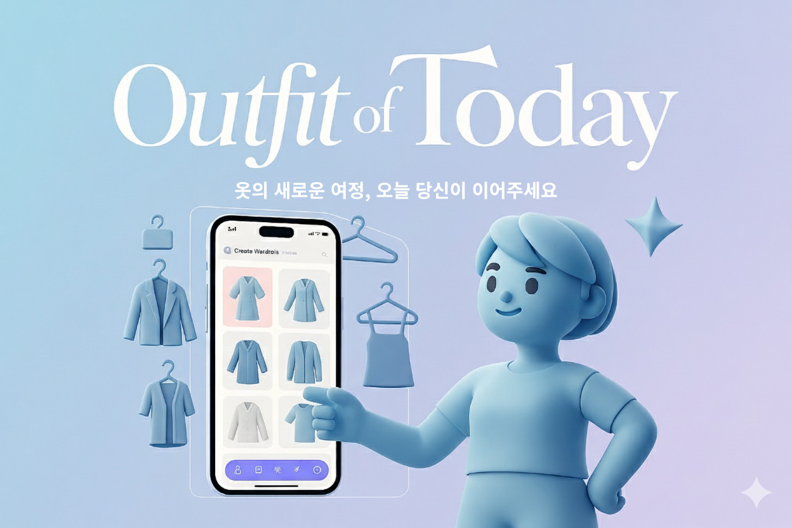
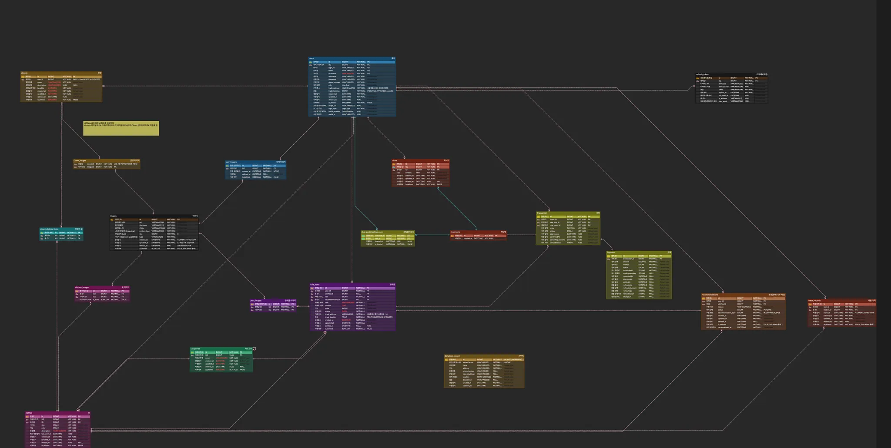

# OOT(Outfit of Today)



## 1. 프로젝트 개요

OOT는 **의류 기반 중고 거래 플랫폼**과 **디지털 옷장 관리 서비스**를 결합하여, 옷의 활용도를 높이고 의류 순환을 통한 환경 보호에 기여합니다.

- 회원 대상: 옷장 관리, 중고 거래, 추천 기능
- 비회원 대상: 공개 옷장 및 중고 거래글 조회
- 옷 기부 및 판매 추천, 소셜 로그인·멀티 디바이스 관리 지원
- 직거래 중심, 독립적 거래(옷장 없이도 거래 가능)

## 기간

- 2025년 10월 13일 ~ 2025년 11월 18일

---

## 2. 기술 스택

**Language/Backend**

- Java 17
- Spring Boot, Spring Data JPA, QueryDSL
- Spring Batch
- Gradle, Lombok

**Frontend**

- Next.js 15.3.3(App Router)
- TypeScript
- Tailwind CSS
- shadcn/ui
- Recharts

**Security**

- JWT, Spring Security, OAuth 2.0

**Test/문서화**

- Swagger, Postman

**IDE**

- IntelliJ IDEA, VS Code

**협업/설계**

- Github, Slack, Notion, ERDCloud, Figma, Zep, draw.io

**외부 API**

- Google(OAuth 2.0), Kakao Maps, Toss Payments

**실시간 통신**

- WebSocket

**클라우드**

- AWS EC2, S3, VPC, RDS

**배포/인프라**

- Git Actions, Docker

**모니터링**

- Prometheus, Grafana, Loki, K6, Promtail, Redis Insight

**DB**

- MySQL 8.0, Redis

---

## 3. 아키텍처/ERD

- **전체 구조**: SRP(Single Responsibility Principle) 단일 책임 원칙 구조, React 프론트엔드, AWS EC2 배포

## 와이어프레임

## ERD 

## API 명세서

### Auth

| Method | URL                                  | 기능                    | Request Header                       | Request Param                 | Request Body                                                                                                                                                          | Response Header                                 | Response Body                                                                                                                                                                                                                                                                                                                                                                                                                                           | 성공코드        | 에러코드                                                                                        |
|--------|--------------------------------------|-----------------------|--------------------------------------|-------------------------------|-----------------------------------------------------------------------------------------------------------------------------------------------------------------------|-------------------------------------------------|---------------------------------------------------------------------------------------------------------------------------------------------------------------------------------------------------------------------------------------------------------------------------------------------------------------------------------------------------------------------------------------------------------------------------------------------------------|-------------|---------------------------------------------------------------------------------------------|
| POST   | `/api/v1/auth/signup`                | 회원가입                  | Content-Type: application/json       | -                             | <pre>{<br>  "loginId": String,<br>  "email": String,<br>  "nickname": String,<br>  "username": String,<br>  "password": String,<br>  "phoneNumber": String<br>}</pre> | HTTP/1.1 응답코드<br>Content-Type: application/json | <pre>{<br>  "httpStatus": HttpStatus,<br>  "statusValue": int,<br>  "success": boolean,<br>  "code": String,<br>  "message": String,<br>  "data": null,<br>  "timestamp": LocalDateTime<br>}</pre>                                                                                                                                                                                                                                                      | 201 CREATED | 400 BAD REQUEST, <br> 409 CONFLICT, <br> 500 INTERNAL SERVER ERROR                          |
| POST   | `/api/v1/auth/login`                 | 로그인                   | Content-Type: application/json       | -                             | <pre>{<br>  "loginId": String,<br>  "password": String,<br>  "deviceId": String,<br>  "deviceName": String<br>}</pre>                                                 | HTTP/1.1 응답코드<br>Content-Type: application/json | <pre>{<br>  "httpStatus": HttpStatus,<br>  "statusValue": int,<br>  "success": boolean,<br>  "code": String,<br>  "message": String,<br>  "data": {<br>    "accessToken": String,<br>    "refreshToken": String<br>  },<br>  "timestamp": LocalDateTime<br>}</pre>                                                                                                                                                                                      | 200 OK      | 400 BAD REQUEST, <br> 401 UNAUTHORIZED, <br>  404 NOT FOUND, <br> 500 INTERNAL SERVER ERROR |
| POST   | `/api/v1/auth/logout/{deviceId}`     | 로그아웃                  | Authorization: Bearer {access_token} | -                             | -                                                                                                                                                                     | HTTP/1.1 응답코드<br>Content-Type: application/json | <pre>{<br>  "httpStatus": HttpStatus,<br>  "statusValue": int,<br>  "success": boolean,<br>  "code": String,<br>  "message": String,<br>  "data": null,<br>  "timestamp": LocalDateTime<br>}</pre>                                                                                                                                                                                                                                                      | 200 OK      | 401 UNAUTHORIZED, <br> 500 INTERNAL SERVER ERROR                                            |
| DELETE | `/api/v1/auth/withdraw`              | 회원탈퇴                  | Authorization: Bearer {access_token} | -                             | <pre>{<br>  "password": String<br>}</pre>                                                                                                                             | HTTP/1.1 응답코드<br>Content-Type: application/json | <pre>{<br>  "httpStatus": HttpStatus,<br>  "statusValue": int,<br>  "success": boolean,<br>  "code": String,<br>  "message": String,<br>  "data": null,<br>  "timestamp": LocalDateTime<br>}</pre>                                                                                                                                                                                                                                                      | 200 OK      | 400 BAD REQUEST, <br> 401 UNAUTHORIZED, <br> 500 INTERNAL SERVER ERROR                      |
| -      | `/api/oauth2/authorization/google`   | 외부(소셜) 로그인            | -                                    | -                             | -                                                                                                                                                                     | -                                               | -                                                                                                                                                                                                                                                                                                                                                                                                                                                       | -           | -                                                                                           |
| GET    | `/api/v1/auth/devices`               | 디바이스 목록 조회            | Authorization: Bearer {access_token} | "currentDeviceId": String(필수) | -                                                                                                                                                                     | HTTP/1.1 응답코드<br>Content-Type: application/json | <pre>{<br>  "httpStatus": HttpStatus,<br>  "statusValue": int,<br>  "success": boolean,<br>  "code": String,<br>  "message": String,<br>  "data": [<br>    {<br>      "deviceId": String,<br>      "deviceName": String,<br>      "lastUsedAt": LocalDateTime,<br>      "expiresAt": LocalDateTime,<br>      "ipAddress": String,<br>      "userAgent": String,<br>      "current": boolean<br>    }<br>  ],<br>  "timestamp": LocalDateTime<br>}</pre> | 200 OK      | 400 BAD REQUEST, <br> 401 UNAUTHORIZED, <br> 500 INTERNAL SERVER ERROR                      |
| DELETE | `/api/v1/auth/devices/{deviceId}`    | 디바이스 단건 제거            | Authorization: Bearer {access_token} | "currentDeviceId": String(필수) | -                                                                                                                                                                     | HTTP/1.1 응답코드<br>Content-Type: application/json | <pre>{<br>  "httpStatus": HttpStatus,<br>  "statusValue": int,<br>  "success": boolean,<br>  "code": String,<br>  "message": String,<br>  "data": null,<br>  "timestamp": LocalDateTime<br>}</pre>                                                                                                                                                                                                                                                      | 200 OK      | 400 BAD REQUEST, <br> 401 UNAUTHORIZED, <br>  404 NOT FOUND, <br> 500 INTERNAL SERVER ERROR |
| POST   | `/api/v1/auth/logout/all`            | 디바이스 전체 로그아웃          | Authorization: Bearer {access_token} | -                             | -                                                                                                                                                                     | HTTP/1.1 응답코드<br>Content-Type: application/json | <pre>{<br>  "httpStatus": HttpStatus,<br>  "statusValue": int,<br>  "success": boolean,<br>  "code": String,<br>  "message": String,<br>  "data": null,<br>  "timestamp": LocalDateTime<br>}</pre>                                                                                                                                                                                                                                                      | 200 OK      | 401 UNAUTHORIZED, <br> 500 INTERNAL SERVER ERROR                                            |
| POST   | `/api/v1/auth/refresh`               | 액세스&리프레시 토큰 발급        | Content-Type: application/json       | -                             | <pre>{<br>  "refreshToken": String<br>}</pre>                                                                                                                         | HTTP/1.1 응답코드<br>Content-Type: application/json | <pre>{<br>  "httpStatus": HttpStatus,<br>  "statusValue": int,<br>  "success": boolean,<br>  "code": String,<br>  "message": String,<br>  "data": {<br>    "accessToken": String,<br>    "refreshToken": String<br>  },<br>  "timestamp": LocalDateTime<br>}</pre>                                                                                                                                                                                      | 200 OK      | 400 BAD REQUEST, <br> 401 UNAUTHORIZED, <br> 500 INTERNAL SERVER ERROR                      |
| POST   | `/api/v1/auth/oauth2/token/exchange` | 임시 코드로 액세스&리프레시 토큰 교환 | Content-Type: application/json       | -                             | <pre>{<br>  "code": String,<br>  "deviceId": String,<br>  "deviceName": String<br>}</pre>                                                                             | HTTP/1.1 응답코드<br>Content-Type: application/json | <pre>{<br>  "httpStatus": HttpStatus,<br>  "statusValue": int,<br>  "success": boolean,<br>  "code": String,<br>  "message": String,<br>  "data": {<br>    "accessToken": String,<br>    "refreshToken": String<br>  },<br>  "timestamp": LocalDateTime<br>}</pre>                                                                                                                                                                                      | 200 OK      | 400 BAD REQUEST, <br> 500 INTERNAL SERVER ERROR                                             |

### User

| Method | URL                                      | 기능                | Request Header                                                         | Request Param | Request Body                                                                                                                                  | Response Header                                 | Response Body                                                                                                                                                                                                                                                                                                                                                                                                                                                                                                                                          | 성공코드   | 에러코드                                                                   |
|--------|------------------------------------------|-------------------|------------------------------------------------------------------------|---------------|-----------------------------------------------------------------------------------------------------------------------------------------------|-------------------------------------------------|--------------------------------------------------------------------------------------------------------------------------------------------------------------------------------------------------------------------------------------------------------------------------------------------------------------------------------------------------------------------------------------------------------------------------------------------------------------------------------------------------------------------------------------------------------|--------|------------------------------------------------------------------------|
| GET    | `/api/v1/users/me`                       | 회원정보 조회           | Authorization: Bearer {access_token}                                   | -             | -                                                                                                                                             | HTTP/1.1 응답코드<br>Content-Type: application/json | <pre>{<br>  "httpStatus": HttpStatus,<br>  "statusValue": int,<br>  "success": boolean,<br>  "code": String,<br>  "message": String,<br>  "data": {<br>    "imageUrl": String,<br>    "loginId": String,<br>    "email": String,<br>    "nickname": String,<br>    "username": String,<br>    "phoneNumber": String,<br>    "tradeAddress": String,<br>    "tradeLatitude": BigDecimal,<br>    "tradeLongitude": BigDecimal,<br>    "loginType": LoginType,<br>    "socialProvider": SocialProvider<br>  },<br>  "timestamp": LocalDateTime<br>}</pre> | 200 OK | 401 UNAUTHORIZED, <br> 500 INTERNAL SERVER ERROR                       |
| POST   | `/api/v1/users/me/password-verification` | 회원정보 수정 전 비밀번호 검증 | Authorization: Bearer {access_token}<br>Content-Type: application/json | -             | <pre>{<br>  "password": String<br>}</pre>                                                                                                     | HTTP/1.1 응답코드<br>Content-Type: application/json | <pre>{<br>  "httpStatus": HttpStatus,<br>  "statusValue": int,<br>  "success": boolean,<br>  "code": String,<br>  "message": String,<br>  "data": null,<br>  "timestamp": LocalDateTime<br>}</pre>                                                                                                                                                                                                                                                                                                                                                     | 200 OK | 400 BAD REQUEST, <br> 401 UNAUTHORIZED, <br> 500 INTERNAL SERVER ERROR |
| PATCH  | `/api/v1/users/me`                       | 회원정보 수정           | Authorization: Bearer {access_token}<br>Content-Type: application/json | -             | <pre>{<br>  "email": String,<br>  "nickname": String,<br>  "username": String,<br>  "password": String,<br>  "phoneNumber": String<br>}</pre> | HTTP/1.1 응답코드<br>Content-Type: application/json | <pre>{<br>  "httpStatus": HttpStatus,<br>  "statusValue": int,<br>  "success": boolean,<br>  "code": String,<br>  "message": String,<br>  "data": {<br>    "email": String,<br>    "nickname": String,<br>    "username": String,<br>    "phoneNumber": String<br>  },<br>  "timestamp": LocalDateTime<br>}</pre>                                                                                                                                                                                                                                      | 200 OK | 400 BAD REQUEST, <br> 401 UNAUTHORIZED, <br> 500 INTERNAL SERVER ERROR |
| PATCH  | `/api/v1/users/me/locations`             | 회원 거래 위치 수정       | Authorization: Bearer {access_token}<br>Content-Type: application/json | -             | <pre>{<br>  "tradeAddress": String,<br>  "tradeLongitude": BigDecimal,<br>  "tradeLatitude": BigDecimal<br>}</pre>                            | HTTP/1.1 응답코드<br>Content-Type: application/json | <pre>{<br>  "httpStatus": HttpStatus,<br>  "statusValue": int,<br>  "success": boolean,<br>  "code": String,<br>  "message": String,<br>  "data": null,<br>  "timestamp": LocalDateTime<br>}</pre>                                                                                                                                                                                                                                                                                                                                                     | 200 OK | 400 BAD REQUEST, <br> 500 INTERNAL SERVER ERROR                        |
| PUT    | `/api/v1/users/me/profile-image`         | 회원 프로필 이미지 수정(등록) | Authorization: Bearer {access_token}<br>Content-Type: application/json | -             | <pre>{<br>  "imageId": Long<br>}</pre>                                                                                                        | HTTP/1.1 응답코드<br>Content-Type: application/json | <pre>{<br>  "httpStatus": HttpStatus,<br>  "statusValue": int,<br>  "success": boolean,<br>  "code": String,<br>  "message": String,<br>  "data": {<br>    "userId": Long,<br>    "imageUrl": String<br>  },<br>  "timestamp": LocalDateTime<br>}</pre>                                                                                                                                                                                                                                                                                                | 200 OK | 401 UNAUTHORIZED, <br> 404 NOT FOUND, <br> 500 INTERNAL SERVER ERROR   |
| DELETE | `/api/v1/users/me/profile-image`         | 회원 프로필 이미지 삭제     | Authorization: Bearer {access_token}                                   | -             | -                                                                                                                                             | HTTP/1.1 응답코드<br>Content-Type: application/json | <pre>{<br>  "httpStatus": HttpStatus,<br>  "statusValue": int,<br>  "success": boolean,<br>  "code": String,<br>  "message": String,<br>  "data": null,<br>  "timestamp": LocalDateTime<br>}</pre>                                                                                                                                                                                                                                                                                                                                                     | 200 OK | 401 UNAUTHORIZED, <br> 404 NOT FOUND, <br> 500 INTERNAL SERVER ERROR   |

### Closet

| Method | URL                          | 기능           | Request Header                                                         | Request Param                                                               | Request Body                                                                                                      | Response Header                                 | Response Body                                                                                                                                                                                                                                                                                                                                                                                                                                                                                                                                                                                    | 성공코드        | 에러코드                                                                                                           |
|--------|------------------------------|--------------|------------------------------------------------------------------------|-----------------------------------------------------------------------------|-------------------------------------------------------------------------------------------------------------------|-------------------------------------------------|--------------------------------------------------------------------------------------------------------------------------------------------------------------------------------------------------------------------------------------------------------------------------------------------------------------------------------------------------------------------------------------------------------------------------------------------------------------------------------------------------------------------------------------------------------------------------------------------------|-------------|----------------------------------------------------------------------------------------------------------------|
| POST   | `/api/v1/closets`            | 옷장 등록        | Authorization: Bearer {access_token}<br>Content-Type: application/json | -                                                                           | <pre>{<br>  "name": String,<br>  "description": String,<br>  "imageId": Long,<br>  "isPublic": Boolean<br>}</pre> | HTTP/1.1 응답코드<br>Content-Type: application/json | <pre>{<br>  "httpStatus": HttpStatus,<br>  "statusValue": int,<br>  "success": Boolean,<br>  "code": String,<br>  "message": String,<br>  "data": {<br>    "closetId": Long,<br>    "userId": Long,<br>    "name": String,<br>    "description": String,<br>    "imageUrl": String,<br>    "isPublic": Boolean,<br>    "createdAt": LocalDateTime,<br>    "updatedAt": LocalDateTime<br>  },<br>  "timestamp": LocalDateTime<br>}</pre>                                                                                                                                                          | 201 CREATED | 400 BAD REQUEST, <br> 401 UNAUTHORIZED, <br>  404 NOT FOUND, <br> 500 INTERNAL SERVER ERROR                    |
| GET    | `/api/v1/closets/public`     | 공개 옷장 리스트 조회 | -                                                                      | "page": int, <br> "size": int, <br> "sort": String <br> "direction": String | -                                                                                                                 | HTTP/1.1 응답코드<br>Content-Type: application/json | <pre>{<br>  "httpStatus": HttpStatus,<br>  "statusValue": int,<br>  "success": Boolean,<br>  "code": String,<br>  "message": String,<br>  "data": {<br>    "content": [<br>      {<br>        "closetId": Long,<br>        "name": String,<br>        "description": String,<br>        "imageUrl": String,<br>        "isPublic": Boolean,<br>        "createdAt": LocalDateTime,<br>        "updatedAt": LocalDateTime<br>      }<br>    ],<br>    "totalElements": int,<br>    "totalPages": int,<br>    "size": int,<br>    "number": int<br>  },<br>  "timestamp": LocalDateTime<br>}</pre> | 200 OK      | 500 INTERNAL SERVER ERROR                                                                                      |
| GET    | `/api/v1/closets/{closetId}` | 옷장 상세 조회     | Authorization: Bearer {access_token}                                   | -                                                                           | -                                                                                                                 | HTTP/1.1 응답코드<br>Content-Type: application/json | <pre>{<br>  "httpStatus": HttpStatus,<br>  "statusValue": int,<br>  "success": Boolean,<br>  "code": String,<br>  "message": String,<br>  "data": {<br>    "closetId": Long,<br>    "name": String,<br>    "description": String,<br>    "imageUrl": String,<br>    "isPublic": Boolean,<br>    "createdAt": LocalDateTime,<br>    "updatedAt": LocalDateTime<br>  },<br>  "timestamp": LocalDateTime<br>}</pre>                                                                                                                                                                                 | 200 OK      | 401 UNAUTHORIZED, <br>  404 NOT FOUND, <br> 500 INTERNAL SERVER ERROR                                          |
| GET    | `/api/v1/closets/me`         | 내 옷장 리스트 조회  | Authorization: Bearer {access_token}                                   | "page": int, <br> "size": int, <br> "sort": String <br> "direction": String | -                                                                                                                 | HTTP/1.1 응답코드<br>Content-Type: application/json | <pre>{<br>  "httpStatus": HttpStatus,<br>  "statusValue": int,<br>  "success": Boolean,<br>  "code": String,<br>  "message": String,<br>  "data": {<br>    "content": [<br>      {<br>        "closetId": Long,<br>        "name": String,<br>        "description": String,<br>        "imageUrl": String,<br>        "isPublic": Boolean,<br>        "createdAt": LocalDateTime,<br>        "updatedAt": LocalDateTime<br>      }<br>    ],<br>    "totalElements": int,<br>    "totalPages": int,<br>    "size": int,<br>    "number": int<br>  },<br>  "timestamp": LocalDateTime<br>}</pre> | 200 OK      | 401 UNAUTHORIZED, <br> 500 INTERNAL SERVER ERROR                                                               |
| PUT    | `/api/v1/closets/{closetId}` | 옷장 정보 수정     | Authorization: Bearer {access_token}<br>Content-Type: application/json | -                                                                           | <pre>{<br>  "name": String,<br>  "description": String,<br>  "imageId": Long,<br>  "isPublic": Boolean<br>}</pre> | HTTP/1.1 응답코드<br>Content-Type: application/json | <pre>{<br>  "httpStatus": HttpStatus,<br>  "statusValue": int,<br>  "success": Boolean,<br>  "code": String,<br>  "message": String,<br>  "data": {<br>    "closetId": Long,<br>    "name": String,<br>    "description": String,<br>    "imageUrl": String,<br>    "isPublic": Boolean,<br>    "updatedAt": LocalDateTime<br>  },<br>  "timestamp": LocalDateTime<br>}</pre>                                                                                                                                                                                                                    | 200 OK      | 400 BAD REQUEST, <br> 401 UNAUTHORIZED, <br> 403 FORBIDDEN, <br> 404 NOT FOUND, <br> 500 INTERNAL SERVER ERROR |
| DELETE | `/api/v1/closets/{closetId}` | 옷장 삭제        | Authorization: Bearer {access_token}<br>Content-Type: application/json | -                                                                           | -                                                                                                                 | HTTP/1.1 응답코드<br>Content-Type: application/json | <pre>{<br>  "httpStatus": HttpStatus,<br>  "statusValue": int,<br>  "success": Boolean,<br>  "code": String,<br>  "message": String,<br>  "data": {<br>    "closetId": Long,<br>    "deletedAt": LocalDateTime<br>  },<br>  "timestamp": LocalDateTime<br>}</pre>                                                                                                                                                                                                                                                                                                                                | 200 OK      | 401 UNAUTHORIZED, <br> 403 FORBIDDEN, <br> 404 NOT FOUND, <br> 500 INTERNAL SERVER ERROR                       |

### Clothes

| Method | URL                                         | 기능               | Request Header                                                         | Request Param                                                                                                                       | Request Body                                                                                                                                                       | Response Header                                 | Response Body                                                                                                                                                                                                                                                                                                                                                                                                                                                                                                                                                                                                                                                                                                                            | 성공코드        | 에러코드                                                                                                                              |
|--------|---------------------------------------------|------------------|------------------------------------------------------------------------|-------------------------------------------------------------------------------------------------------------------------------------|--------------------------------------------------------------------------------------------------------------------------------------------------------------------|-------------------------------------------------|------------------------------------------------------------------------------------------------------------------------------------------------------------------------------------------------------------------------------------------------------------------------------------------------------------------------------------------------------------------------------------------------------------------------------------------------------------------------------------------------------------------------------------------------------------------------------------------------------------------------------------------------------------------------------------------------------------------------------------------|-------------|-----------------------------------------------------------------------------------------------------------------------------------|
| POST   | `/api/v1/clothes`                           | 옷 등록             | Authorization: Bearer {access_token}<br>Content-Type: application/json | -                                                                                                                                   | <pre>{<br>  "categoryId": Long,<br>  "clothesSize": ClothesSize,<br>  "clothesColor": ClothesColor,<br>  "description": String,<br>  "images": [ Long ]<br>}</pre> | HTTP/1.1 응답코드<br>Content-Type: application/json | <pre>{<br>  "httpStatus": HttpStatus,<br>  "statusValue": int,<br>  "success": boolean,<br>  "code": String,<br>  "message": String,<br>  "data": {<br>    "id": Long,<br>    "categoryId": Long,<br>    "userId": Long,<br>    "clothesSize": ClothesSize,<br>    "clothesColor": ClothesColor,<br>    "description": String,<br>    "clothesImages": [<br>      {<br>        "id": Long,<br>        "imageUrl": String,<br>        "isMain": boolean<br>      }<br>    ]<br>  },<br>  "timestamp": LocalDateTime<br>}</pre>                                                                                                                                                                                                            | 201 CREATED | 400 BAD REQUEST, <br> 401 UNAUTHORIZED, <br> 404 NOT FOUND, <br> 409 CONFLICT, <br> 500 INTERNAL SERVER ERROR                     |
| GET    | `/api/v1/clothes`                           | 옷 리스트 조회         | Authorization: Bearer {access_token}                                   | "categoryId": Long, <br> "clothesColor": ClothesColor, <br> "clothesSize":ClothesSize, <br> "lastClothesId": Long, <br> "size": int | -                                                                                                                                                                  | HTTP/1.1 응답코드<br>Content-Type: application/json | <pre>{<br>  "httpStatus": HttpStatus,<br>  "statusValue": int,<br>  "success": boolean,<br>  "code": String,<br>  "message": String,<br>  "data": {<br>    "content": [<br>      {<br>        "id": Long,<br>        "categoryId": Long,<br>        "userId": Long,<br>        "clothesSize": ClothesSize,<br>        "clothesColor": ClothesColor,<br>        "description": String,<br>        "clothesImages": [<br>          {<br>            "id": Long,<br>            "imageUrl": String,<br>            "isMain": boolean<br>          }<br>        ]<br>      }<br>    ],<br>    "size": int,<br>    "number": int,<br>    "hasNext": boolean,<br>    "hasPrevious": boolean<br>  },<br>  "timestamp": LocalDateTime<br>}</pre> | 200 OK      | 401 UNAUTHORIZED, <br> 500 INTERNAL SERVER ERROR                                                                                  |
| GET    | `/api/v1/clothes/{clothesId}`               | 특정 옷 조회          | Authorization: Bearer {access_token}                                   | -                                                                                                                                   | -                                                                                                                                                                  | HTTP/1.1 응답코드<br>Content-Type: application/json | <pre>{<br>  "httpStatus": HttpStatus,<br>  "statusValue": int,<br>  "success": boolean,<br>  "code": String,<br>  "message": String,<br>  "data": {<br>    "id": Long,<br>    "categoryId": Long,<br>    "userId": Long,<br>    "clothesSize": ClothesSize,<br>    "clothesColor": ClothesColor,<br>    "description": String,<br>    "clothesImages": [<br>      {<br>        "id": Long,<br>        "imageUrl": String,<br>        "isMain": boolean<br>      }<br>    ]<br>  },<br>  "timestamp": LocalDateTime<br>}</pre>                                                                                                                                                                                                            | 200 OK      | 401 UNAUTHORIZED, <br> 403 FORBIDDEN, <br> 404 NOT FOUND, <br> 500 INTERNAL SERVER ERROR                                          |
| PUT    | `/api/v1/clothes/{clothesId}`               | 옷 정보 수정          | Authorization: Bearer {access_token}<br>Content-Type: application/json | -                                                                                                                                   | <pre>{<br>  "categoryId": Long,<br>  "clothesSize": ClothesSize,<br>  "clothesColor": ClothesColor,<br>  "description": String,<br>  "images": [ Long ]<br>}</pre> | HTTP/1.1 응답코드<br>Content-Type: application/json | <pre>{<br>  "httpStatus": HttpStatus,<br>  "statusValue": int,<br>  "success": boolean,<br>  "code": String,<br>  "message": String,<br>  "data": {<br>    "id": Long,<br>    "categoryId": Long,<br>    "userId": Long,<br>    "clothesSize": ClothesSize,<br>    "clothesColor": ClothesColor,<br>    "description": String,<br>    "clothesImages": [<br>      {<br>        "id": Long,<br>        "imageUrl": String,<br>        "isMain": boolean<br>      }<br>    ]<br>  },<br>  "timestamp": LocalDateTime<br>}</pre>                                                                                                                                                                                                            | 200 OK      | 400 BAD REQUEST, <br> 401 UNAUTHORIZED, <br> 403 FORBIDDEN, <br> 404 NOT FOUND, <br> 409 CONFLICT, <br> 500 INTERNAL SERVER ERROR |
| DELETE | `/api/v1/clothes/{clothesId}`               | 옷 삭제             | Authorization: Bearer {access_token}<br>Content-Type: application/json | -                                                                                                                                   | -                                                                                                                                                                  | HTTP/1.1 응답코드<br>Content-Type: application/json | <pre>{<br>  "httpStatus": String,<br>  "statusValue": int,<br>  "success": boolean,<br>  "code": String,<br>  "message": String,<br>  "data": null,<br>  "timestamp": LocalDateTime<br>}</pre>                                                                                                                                                                                                                                                                                                                                                                                                                                                                                                                                           | 200 OK      | 401 UNAUTHORIZED, <br> 403 FORBIDDEN, <br> 404 NOT FOUND, <br> 500 INTERNAL SERVER ERROR                                          |
| POST   | `/api/v1/clothes/{clothesId}/images/remove` | 해당 옷에 등록된 이미지 제거 | Authorization: Bearer {access_token}<br>Content-Type: application/json | -                                                                                                                                   | <pre>{<br>  "imageIds": [Long]<br>}</pre>                                                                                                                          | HTTP/1.1 응답코드<br>Content-Type: application/json | <pre>{<br>  "httpStatus": String,<br>  "statusValue": int,<br>  "success": boolean,<br>  "code": String,<br>  "message": String,<br>  "data": null,<br>  "timestamp": LocalDateTime<br>}</pre>                                                                                                                                                                                                                                                                                                                                                                                                                                                                                                                                           | 200 OK      | 401 UNAUTHORIZED, <br> 404 NOT FOUND, <br> 500 INTERNAL SERVER ERROR                                                              |

### SalePost

| Method | URL                                      | 기능            | Request Header                                                         | Request Param                                                                                                                                            | Request Body                                                                                                                                                                                                                                      | Response Header                                 | Response Body                                                                                                                                                                                                                                                                                                                                                                                                                                                                                                                                                                                                                                                                                                                                                                                                                                                                                                                                                                                                                                                                                                                                          | 성공코드        | 에러코드                                                                                                            |
|--------|------------------------------------------|---------------|------------------------------------------------------------------------|----------------------------------------------------------------------------------------------------------------------------------------------------------|---------------------------------------------------------------------------------------------------------------------------------------------------------------------------------------------------------------------------------------------------|-------------------------------------------------|--------------------------------------------------------------------------------------------------------------------------------------------------------------------------------------------------------------------------------------------------------------------------------------------------------------------------------------------------------------------------------------------------------------------------------------------------------------------------------------------------------------------------------------------------------------------------------------------------------------------------------------------------------------------------------------------------------------------------------------------------------------------------------------------------------------------------------------------------------------------------------------------------------------------------------------------------------------------------------------------------------------------------------------------------------------------------------------------------------------------------------------------------------|-------------|-----------------------------------------------------------------------------------------------------------------|
| POST   | `/api/v1/sale-posts`                     | 판매글 생성        | Authorization: Bearer {access_token}<br>Content-Type: application/json | -                                                                                                                                                        | <pre>{<br>  "title": String,<br>  "content": String,<br>  "price": BigDecimal,<br>  "categoryId": String,<br>  "tradeAddress": String,<br>  "tradeLatitude": BigDecimal,<br>  "tradeLongitude": BigDecimal,<br>  "imageUrls": [String]<br>}</pre> | HTTP/1.1 응답코드<br>Content-Type: application/json | <pre>{<br>  "httpStatus": HttpStatus,<br>  "statusValue": int,<br>  "success": boolean,<br>  "code": String,<br>  "message": String,<br>  "data": {<br>    "salePostId": Long,<br>    "title": String,<br>    "content": String,<br>    "price": BigDecimal,<br>    "status": SaleStatus,<br>    "tradeAddress": String,<br>    "tradeLatitude": BigDecimal,<br>    "tradeLongitude": BigDecimal,<br>    "userId": Long,<br>    "categoryId": Long,<br>    "image": [<br>      {<br>        "imageId": Long,<br>        "imageUrl": String,<br>        "displayOrder": Integer,<br>        "isMain": Boolean<br>      }<br>    ],<br>    "createdAt": LocalDateTime<br>  },<br>  "timestamp": LocalDateTime<br>}</pre>                                                                                                                                                                                                                                                                                                                                                                                                                                 | 201 CREATED | 400 BAD REQUEST, <br> 401 UNAUTHORIZED, <br>  404 NOT FOUND, <br> 500 INTERNAL SERVER ERROR                     |
| GET    | `/api/v1/sale-posts/{salePostId}`        | 특정 판매글 조회     | Authorization: Bearer {access_token}                                   | -                                                                                                                                                        | -                                                                                                                                                                                                                                                 | HTTP/1.1 응답코드<br>Content-Type: application/json | <pre>{<br>  "httpStatus": HttpStatus,<br>  "statusValue": int,<br>  "success": boolean,<br>  "code": String,<br>  "message": String,<br>  "data": {<br>    "salePostId": Long,<br>    "title": String,<br>    "content": String,<br>    "price": BigDecimal,<br>    "status": SaleStatus,<br>    "tradeAddress": String,<br>    "tradeLatitude": BigDecimal,<br>    "tradeLongitude": BigDecimal,<br>    "sellerId": Long,<br>    "sellerNickname": String,<br>    "sellerImageUrl": String,<br>    "categoryName": String,<br>    "imageUrls": [String],<br>    "createdAt": LocalDateTime,<br>    "updatedAt": LocalDateTime<br>  },<br>  "timestamp": LocalDateTime<br>}</pre>                                                                                                                                                                                                                                                                                                                                                                                                                                                                      | 200 OK      | 401 UNAUTHORIZED, <br>  404 NOT FOUND, <br> 500 INTERNAL SERVER ERROR                                           |
| GET    | `/api/v1/sale-posts`                     | 판매글 전체 조회     | Authorization: Bearer {access_token}                                   | "categoryId": Long, <br> "status": SaleStatus, <br> "keyword": String, <br> "page": int, <br> "size": int, <br> "sort": String, <br> "direction": String | -                                                                                                                                                                                                                                                 | HTTP/1.1 응답코드<br>Content-Type: application/json | <pre>{<br>  "httpStatus": HttpStatus,<br>  "statusValue": int,<br>  "success": boolean,<br>  "code": String,<br>  "message": String,<br>  "data": {<br>    "content": [<br>      {<br>        "salePostId": Long,<br>        "title": String,<br>        "price": BigDecimal,<br>        "status": SaleStatus,<br>        "tradeAddress": String,<br>        "tradeLatitude": BigDecimal,<br>        "tradeLongitude": BigDecimal,<br>        "thumbnailUrl": String,<br>        "sellerNickName": String,<br>        "categoryName": String,<br>        "createdAt": LocalDateTime<br>      }<br>    ],<br>    "number": int,<br>    "sort": {<br>      "empty": boolean,<br>      "unsorted": boolean,<br>      "sorted": boolean<br>    },<br>    "numberOfElements": int,<br>    "pageable": {<br>      "offset": Long,<br>      "sort": {<br>        "empty": boolean,<br>        "unsorted": boolean,<br>        "sorted": boolean<br>      },<br>      "unpaged": boolean,<br>      "paged": boolean,<br>      "pageNumber": int,<br>      "pageSize": int<br>    },<br>    "empty": boolean<br>  },<br>  "timestamp": LocalDateTime<br>}</pre> | 200 OK      | 401 UNAUTHORIZED, <br> 500 INTERNAL SERVER ERROR                                                                |
| GET    | `/api/v1/sale-posts/public`              | 비회원 판매글 전체 조회 | -                                                                      | "categoryId": Long, <br> "status": SaleStatus, <br> "keyword": String, <br> "page": int, <br> "size": int, <br> "sort": String, <br> "direction": String | -                                                                                                                                                                                                                                                 | HTTP/1.1 응답코드<br>Content-Type: application/json | <pre>{<br>  "httpStatus": HttpStatus,<br>  "statusValue": int,<br>  "success": boolean,<br>  "code": String,<br>  "message": String,<br>  "data": {<br>    "content": [<br>      {<br>        "salePostId": Long,<br>        "title": String,<br>        "price": BigDecimal,<br>        "status": SaleStatus,<br>        "tradeAddress": String,<br>        "tradeLatitude": BigDecimal,<br>        "tradeLongitude": BigDecimal,<br>        "thumbnailUrl": String,<br>        "sellerNickName": String,<br>        "categoryName": String,<br>        "createdAt": LocalDateTime<br>      }<br>    ],<br>    "page": number,<br>    "size": number,<br>    "first": boolean,<br>    "last": boolean,<br>    "numberOfElements": number,<br>    "empty": boolean<br>  },<br>  "timestamp": LocalDateTime<br>}</pre>                                                                                                                                                                                                                                                                                                                                  | 200 OK      | 400 BAD REQUEST, <br> 500 INTERNAL SERVER ERROR                                                                 |
| GET    | `/api/v1/sale-posts/my`                  | 자신의 판매글 조회    | Authorization: Bearer {access_token}                                   | "status": SaleStatus, <br> "page": int, <br> "size": int, <br> "sort": String, <br> "direction": String                                                  | -                                                                                                                                                                                                                                                 | HTTP/1.1 응답코드<br>Content-Type: application/json | <pre>{<br>  "httpStatus": HttpStatus,<br>  "statusValue": int,<br>  "success": boolean,<br>  "code": String,<br>  "message": String,<br>  "data": {<br>    "content": [<br>      {<br>        "salePostId": Long,<br>        "title": String,<br>        "price": BigDecimal,<br>        "status": SaleStatus,<br>        "tradeAddress": String,<br>        "tradeLatitude": BigDecimal,<br>        "tradeLongitude": BigDecimal,<br>        "thumbnailUrl": String,<br>        "createdAt": LocalDateTime<br>      }<br>    ],<br>    "number": int,<br>    "sort": {<br>      "empty": boolean,<br>      "unsorted": boolean,<br>      "sorted": boolean<br>    },<br>    "numberOfElements": int,<br>    "pageable": {<br>      "offset": Long,<br>      "sort": {<br>        "empty": boolean,<br>        "unsorted": boolean,<br>        "sorted": boolean<br>      },<br>      "unpaged": boolean,<br>      "paged": boolean,<br>      "pageNumber": int,<br>      "pageSize": int<br>    },<br>    "empty": boolean<br>  },<br>  "timestamp": LocalDateTime<br>}</pre>                                                                         | 200 OK      | 401 UNAUTHORIZED, <br>  404 NOT FOUND, <br> 500 INTERNAL SERVER ERROR                                           |
| PUT    | `/api/v1/sale-posts/{salePostId}`        | 판매글 수정        | Authorization: Bearer {access_token}<br>Content-Type: application/json | -                                                                                                                                                        | <pre>{<br>  "title": String,<br>  "content": String,<br>  "price": BigDecimal,<br>  "categoryId": Long,<br>  "tradeAddress": String,<br>  "tradeLatitude": BigDecimal,<br>  "tradeLongitude": BigDecimal,<br>  "imageIds": [Long]<br>}</pre>      | HTTP/1.1 응답코드<br>Content-Type: application/json | <pre>{<br>  "httpStatus": HttpStatus,<br>  "statusValue": int,<br>  "success": boolean,<br>  "code": String,<br>  "message": String,<br>  "data": {<br>    "salePostId": Long,<br>    "title": String,<br>    "content": String,<br>    "price": BigDecimal,<br>    "status": SaleStatus,<br>    "tradeAddress": String,<br>    "tradeLatitude": BigDecimal,<br>    "tradeLongitude": BigDecimal,<br>    "sellerId": Long,<br>    "sellerNickname": String,<br>    "categoryName": String,<br>    "images": [<br>      {<br>        "imageId": Long,<br>        "imageUrl": String,<br>        "displayOrder": Integer,<br>        "isMain": Boolean<br>      }<br>    ],<br>    "createdAt": LocalDateTime,<br>    "updatedAt": LocalDateTime<br>  },<br>  "timestamp": LocalDateTime<br>}</pre>                                                                                                                                                                                                                                                                                                                                                      | 200 OK      | 400 BAD REQUEST, <br> 401 UNAUTHORIZED, <br> 403 FORBIDDEN, <br>  404 NOT FOUND, <br> 500 INTERNAL SERVER ERROR |
| DELETE | `/api/v1/sale-posts/{salePostId}`        | 판매글 삭제        | Authorization: Bearer {access_token}                                   | -                                                                                                                                                        | -                                                                                                                                                                                                                                                 | HTTP/1.1 응답코드<br>Content-Type: application/json | <pre>{<br>  "httpStatus": HttpStatus,<br>  "statusValue": int,<br>  "success": boolean,<br>  "code": String,<br>  "message": String,<br>  "data": null,<br>  "timestamp": LocalDateTime<br>}</pre>                                                                                                                                                                                                                                                                                                                                                                                                                                                                                                                                                                                                                                                                                                                                                                                                                                                                                                                                                     | 200 OK      | 400 BAD REQUEST, <br> 401 UNAUTHORIZED, <br> 403 FORBIDDEN, <br>  404 NOT FOUND, <br> 500 INTERNAL SERVER ERROR |
| PATCH  | `/api/v1/sale-posts/{salePostId}/status` | 판매글 상태 변경     | Authorization: Bearer {access_token}<br>Content-Type: application/json | -                                                                                                                                                        | <pre>{<br>  "status": SaleStatus<br>}</pre>                                                                                                                                                                                                       | HTTP/1.1 응답코드<br>Content-Type: application/json | <pre>{<br>  "httpStatus": HttpStatus,<br>  "statusValue": int,<br>  "success": boolean,<br>  "code": String,<br>  "message": String,<br>  "data": {<br>    "salePostId": Long,<br>    "title": String,<br>    "content": String,<br>    "price": BigDecimal,<br>    "status": SaleStatus,<br>    "tradeAddress": String,<br>    "tradeLatitude": BigDecimal,<br>    "tradeLongitude": BigDecimal,<br>    "sellerId": Long,<br>    "sellerNickname": String,<br>    "categoryName": String,<br>    "imageUrls": [String],<br>    "createdAt": LocalDateTime,<br>    "updatedAt": LocalDateTime<br>  },<br>  "timestamp": LocalDateTime<br>}</pre>                                                                                                                                                                                                                                                                                                                                                                                                                                                                                                       | 200 OK      | 400 BAD REQUEST, <br> 500 INTERNAL SERVER ERROR                                                                 |

### Chat

| Method | URL                                    | 기능        | Request Header                       | Request Param                 | Request Body                             | Response Header                                                                                                                                                    | Response Body                                                                                                                                                                                                                                                                                                                                                                                                                                                                                                                                             | 성공코드   | 에러코드                                                                   |
|--------|----------------------------------------|-----------|--------------------------------------|-------------------------------|------------------------------------------|--------------------------------------------------------------------------------------------------------------------------------------------------------------------|-----------------------------------------------------------------------------------------------------------------------------------------------------------------------------------------------------------------------------------------------------------------------------------------------------------------------------------------------------------------------------------------------------------------------------------------------------------------------------------------------------------------------------------------------------------|--------|------------------------------------------------------------------------|
| SEND   | `/api/ws/chatroom`                     | 채팅 생성     | -                                    | -                             | <pre>{<br>  "content": String<br>}</pre> | <pre>{<br>  "chatroomId": Long,<br>  "userId": Long,<br>  "userNickname": String,<br>  "chatId": Long,<br>  "content": String,<br>  "createdAt": String<br>}</pre> |
| GET    | `/api/v1/chatrooms/{chatroomId}/chats` | 채팅 리스트 조회 | Authorization: Bearer {access_token} | "page": int, <br> "size": int | -                                        | HTTP/1.1 응답코드<br>Content-Type: application/json                                                                                                                    | <pre>{<br>  "httpStatus": HttpStatus,<br>  "statusValue": int,<br>  "success": boolean,<br>  "code": String,<br>  "message": String,<br>  "data": {<br>    "content": [<br>      {<br>        "chatroomId": Long,<br>        "userId": Long,<br>        "userNickname": String,<br>        "chatId": Long,<br>        "content": String,<br>        "createdAt": LocalDateTime<br>      }<br>    ],<br>    "size": int,<br>    "number": int,<br>    "hasNext": boolean,<br>    "hasPrevious": boolean<br>  },<br>  "timestamp": LocalDateTime<br>}</pre> | 200 OK | 400 BAD REQUEST, <br> 401 UNAUTHORIZED, <br> 500 INTERNAL SERVER ERROR |

### ChatRoom

| Method | URL                              | 기능         | Request Header                                                         | Request Param                 | Request Body                              | Response Header                                 | Response Body                                                                                                                                                                                                                                                                                                                                                                                                                                                                   | 성공코드        | 에러코드                                                                   |
|--------|----------------------------------|------------|------------------------------------------------------------------------|-------------------------------|-------------------------------------------|-------------------------------------------------|---------------------------------------------------------------------------------------------------------------------------------------------------------------------------------------------------------------------------------------------------------------------------------------------------------------------------------------------------------------------------------------------------------------------------------------------------------------------------------|-------------|------------------------------------------------------------------------|
| POST   | `/api/v1/chatrooms`              | 채팅방 생성     | Authorization: Bearer {access_token}<br>Content-Type: application/json | -                             | <pre>{<br>  "salePostId": Long<br>}</pre> | HTTP/1.1 응답코드<br>Content-Type: application/json | <pre>{<br>  "httpStatus": HttpStatus,<br>  "statusValue": int,<br>  "success": boolean,<br>  "code": String,<br>  "message": String,<br>  "data": null,<br>  "timestamp": LocalDateTime<br>}</pre>                                                                                                                                                                                                                                                                              | 201 CREATED | 400 BAD REQUEST, <br> 401 UNAUTHORIZED, <br> 500 INTERNAL SERVER ERROR |
| GET    | `/api/v1/chatrooms`              | 채팅방 리스트 조회 | Authorization: Bearer {access_token}<br>Content-Type: application/json | "page": int, <br> "size": int | -                                         | HTTP/1.1 응답코드<br>Content-Type: application/json | <pre>{<br>  "httpStatus": HttpStatus,<br>  "statusValue": int,<br>  "success": boolean,<br>  "code": String,<br>  "message": String,<br>  "data": {<br>    "content": [<br>      {<br>        "otherUserNickname": String,<br>        "finalChat": String,<br>        "afterFinalChatTime": Duration<br>      }<br>    ],<br>    "size": int,<br>    "number": int,<br>    "hasNext": boolean,<br>    "hasPrevious": boolean<br>  },<br>  "timestamp": LocalDateTime<br>}</pre> | 200 OK      | 400 BAD REQUEST, <br> 401 UNAUTHORIZED, <br> 500 INTERNAL SERVER ERROR |
| DELETE | `/api/v1/chatrooms/{chatroomId}` | 채팅방 삭제     | Authorization: Bearer {access_token}                                   | -                             | -                                         | HTTP/1.1 응답코드<br>Content-Type: application/json | <pre>{<br>  "httpStatus": HttpStatus,<br>  "statusValue": int,<br>  "success": boolean,<br>  "code": String,<br>  "message": String,<br>  "data": null,<br>  "timestamp": LocalDateTime<br>}</pre>                                                                                                                                                                                                                                                                              | 200 OK      | 400 BAD REQUEST, <br> 401 UNAUTHORIZED, <br> 500 INTERNAL SERVER ERROR |

### Category

| Method | URL                                     | 기능          | Request Header                                                         | Request Param                                                                | Request Body                                                 | Response Header                                 | Response Body                                                                                                                                                                                                                                                                                                                                                                                                                                                                              | 성공코드        | 에러코드                                                                                                           |
|--------|-----------------------------------------|-------------|------------------------------------------------------------------------|------------------------------------------------------------------------------|--------------------------------------------------------------|-------------------------------------------------|--------------------------------------------------------------------------------------------------------------------------------------------------------------------------------------------------------------------------------------------------------------------------------------------------------------------------------------------------------------------------------------------------------------------------------------------------------------------------------------------|-------------|----------------------------------------------------------------------------------------------------------------|
| POST   | `/api/admin/v1/categories`              | 카테고리 생성     | Authorization: Bearer {access_token}<br>Content-Type: application/json | -                                                                            | <pre>{<br>  "parentId": Long,<br>  "name": String<br>}</pre> | HTTP/1.1 응답코드<br>Content-Type: application/json | <pre>{<br>  "httpStatus": HttpStatus,<br>  "statusValue": int,<br>  "success": boolean,<br>  "code": String,<br>  "message": String,<br>  "data": {<br>    "id": Long,<br>    "name": String,<br>    "createdAt": LocalDateTime,<br>    "updatedAt": LocalDateTime<br>  },<br>  "timestamp": LocalDateTime<br>}</pre>                                                                                                                                                                      | 201 Created | 400 BAD REQUEST, <br> 401 UNAUTHORIZED, <br> 403 FORBIDDEN, <br> 404 NOT FOUND, <br> 500 INTERNAL SERVER ERROR |
| GET    | `/api/v1/categories`                    | 카테고리 리스트 조회 | -                                                                      | "page": int, <br> "size": int, <br> "sort": String, <br> "direction": String | -                                                            | HTTP/1.1 응답코드<br>Content-Type: application/json | <pre>{<br>  "httpStatus": HttpStatus,<br>  "statusValue": int,<br>  "success": boolean,<br>  "code": String,<br>  "message": String,<br>  "data": {<br>    "content": [<br>      {<br>        "id": Long,<br>        "name": String,<br>        "createdAt": LocalDateTime,<br>        "updatedAt": LocalDateTime<br>      }<br>    ],<br>    "totalElements": long,<br>    "totalPages": int,<br>    "size": int,<br>    "number": int<br>  },<br>  "timestamp": LocalDateTime<br>}</pre> | 200 OK      | 401 UNAUTHORIZED, <br> 500 INTERNAL SERVER ERROR                                                               |
| PUT    | `/api/admin/v1/categories/{categoryId}` | 카테고리 수정     | Authorization: Bearer {access_token}<br>Content-Type: application/json | -                                                                            | <pre>{<br>  "parentId": Long,<br>  "name": String<br>}</pre> | HTTP/1.1 응답코드<br>Content-Type: application/json | <pre>{<br>  "httpStatus": HttpStatus,<br>  "statusValue": int,<br>  "success": boolean,<br>  "code": String,<br>  "message": String,<br>  "data": {<br>    "id": Long,<br>    "name": String,<br>    "createdAt": LocalDateTime,<br>    "updatedAt": LocalDateTime<br>  },<br>  "timestamp": LocalDateTime<br>}</pre>                                                                                                                                                                      | 200 OK      | 400 BAD REQUEST, <br> 401 UNAUTHORIZED, <br> 403 FORBIDDEN, <br> 404 NOT FOUND, <br> 500 INTERNAL SERVER ERROR |
| DELETE | `/api/admin/v1/categories/{categoryId}` | 카테고리 삭제     | Authorization: Bearer {access_token}                                   | -                                                                            | -                                                            | HTTP/1.1 응답코드<br>Content-Type: application/json | <pre>{<br>  "httpStatus": HttpStatus,<br>  "statusValue": int,<br>  "success": boolean,<br>  "code": String,<br>  "message": String,<br>  "data": null,<br>  "timestamp": LocalDateTime<br>}</pre>                                                                                                                                                                                                                                                                                         | 200 OK      | 401 UNAUTHORIZED, <br> 403 FORBIDDEN, <br>  404 NOT FOUND, <br> 500 INTERNAL SERVER ERROR                      |

### Recommendation

| Method | URL                                                           | 기능                | Request Header                                                         | Request Param                                                                | Request Body                                                                                                                                                                                                                                    | Response Header                                 | Response Body                                                                                                                                                                                                                                                                                                                                                                                                                                                                                                                                                                                                                                                                                                                 | 성공코드        | 에러코드                                                                                        |
|--------|---------------------------------------------------------------|-------------------|------------------------------------------------------------------------|------------------------------------------------------------------------------|-------------------------------------------------------------------------------------------------------------------------------------------------------------------------------------------------------------------------------------------------|-------------------------------------------------|-------------------------------------------------------------------------------------------------------------------------------------------------------------------------------------------------------------------------------------------------------------------------------------------------------------------------------------------------------------------------------------------------------------------------------------------------------------------------------------------------------------------------------------------------------------------------------------------------------------------------------------------------------------------------------------------------------------------------------|-------------|---------------------------------------------------------------------------------------------|
| GET    | `/api/v1/recommendations`                                     | 추천 기록 목록 조회       | Authorization: Bearer {access_token}                                   | "page": int, <br> "size": int, <br> "sort": String, <br> "direction": String | -                                                                                                                                                                                                                                               | HTTP/1.1 응답코드<br>Content-Type: application/json | <pre>{<br>  "httpStatus": HttpStatus,<br>  "statusValue": int,<br>  "success": Boolean,<br>  "code": String,<br>  "message": String,<br>  "data": {<br>    "content": [<br>      {<br>        "recommendationId": Long,<br>        "userId": Long,<br>        "clothesId": Long,<br>        "clothesName": String,<br>        "clothesImageUrl": String,<br>        "type": RecommendationType,<br>        "reason": String,<br>        "status": RecommendationStatus,<br>        "createdAt": LocalDateTime,<br>        "updatedAt": LocalDateTime<br>      }<br>    ],<br>    "totalElements": long,<br>    "totalPages": int,<br>    "size": int,<br>    "number": int<br>  },<br>  "timestamp": LocalDateTime<br>}</pre> | 200 OK      | 401 UNAUTHORIZED, <br> 500 INTERNAL SERVER ERROR                                            |
| POST   | `/api/v1/recommendations/{recommendationId}/sale-posts`       | 추천 기반 판매글 생성      | Authorization: Bearer {access_token}<br>Content-Type: application/json | "radius": Integer, <br> "keyword": String                                    | <pre>{<br>  "title": String,<br>  "content": String,<br>  "price": BigDecimal,<br>  "categoryId": Long,<br>  "tradeAddress": String,<br>  "tradeLatitude": BigDecimal,<br>  "tradeLongitude": BigDecimal,<br>  "imageUrls": [String]<br>}</pre> | HTTP/1.1 응답코드<br>Content-Type: application/json | <pre>{<br>  "httpStatus": HttpStatus,<br>  "statusValue": int,<br>  "success": Boolean,<br>  "code": String,<br>  "message": String,<br>  "data": {<br>    "salePostId": Long,<br>    "title": String,<br>    "content": String,<br>    "price": BigDecimal,<br>    "status": SaleStatus,<br>    "tradeAddress": String,<br>    "tradeLatitude": BigDecimal,<br>    "tradeLongitude": BigDecimal,<br>    "userId": Long,<br>    "categoryId": Long,<br>    "imageUrls": [String],<br>    "createdAt": LocalDateTime<br>  },<br>  "timestamp": LocalDateTime<br>}</pre>                                                                                                                                                        | 201 CREATED | 400 BAD REQUEST, <br> 401 UNAUTHORIZED, <br>  404 NOT FOUND, <br> 500 INTERNAL SERVER ERROR |
| GET    | `/api/v1/recommendations/{recommendationId}/donation-centers` | 기부 추천에서 주변 기부처 검색 | Authorization: Bearer {access_token}                                   | -                                                                            | -                                                                                                                                                                                                                                               | HTTP/1.1 응답코드<br>Content-Type: application/json | <pre>{<br>  "httpStatus": HttpStatus,<br>  "statusValue": int,<br>  "success": Boolean,<br>  "code": String,<br>  "message": String,<br>  "data": [<br>    {<br>      "donationCenterId": Long,<br>      "kakaoPlaceId": String,<br>      "name": String,<br>      "address": String,<br>      "phoneNumber": String,<br>      "operatingHours": String,<br>      "latitude": Double,<br>      "longitude": Double,<br>      "description": String,<br>      "distance": Integer<br>    }<br>  ],<br>  "timestamp": LocalDateTime<br>}</pre>                                                                                                                                                                                  | 200 OK      | 400 BAD REQUEST, <br> 401 UNAUTHORIZED, <br>  404 NOT FOUND, <br> 500 INTERNAL SERVER ERROR |

### Recommendation(내부 API)

| Method | URL                                                     | 기능                      | Request Header                                                         | Request Param | Request Body | Response Header                                 | Response Body                                                                                                                                                                                                                                                                                                                                               | 성공코드        | 에러코드                                          |
|--------|---------------------------------------------------------|-------------------------|------------------------------------------------------------------------|---------------|--------------|-------------------------------------------------|-------------------------------------------------------------------------------------------------------------------------------------------------------------------------------------------------------------------------------------------------------------------------------------------------------------------------------------------------------------|-------------|-----------------------------------------------|
| POST   | `/api/v1/internal/batch/recommendations/users/{userId}` | 배치용 추천 생성               | Authorization: Bearer {access_token}<br>Content-Type: application/json | -             | -            | HTTP/1.1 응답코드<br>Content-Type: application/json | <pre>{<br>  "httpStatus": HttpStatus,<br>  "statusValue": int,<br>  "success": Boolean,<br>  "code": String,<br>  "message": String,<br>  "data": [<br>    {<br>      "userId": Long,<br>      "clothesId": Long,<br>      "type": String,<br>      "reason": String,<br>      "status": String<br>    }<br>  ],<br>  "timestamp": LocalDateTime<br>}</pre> | 201 CREATED | 404 NOT FOUND, <br> 500 INTERNAL SERVER ERROR |
| GET    | `/api/v1/internal/batch/recommendations/health`         | 메인 서버 Internal API 헬스체크 | -                                                                      | -             | -            | HTTP/1.1 응답코드<br>Content-Type: application/json | <pre>{<br>  "httpStatus": HttpStatus,<br>  "statusValue": int,<br>  "success": Boolean,<br>  "code": String,<br>  "message": String,<br>  "data": String,<br>  "timestamp": LocalDateTime<br>}</pre>                                                                                                                                                        | 200 OK      | 500 INTERNAL SERVER ERROR                     |

### Donation

| Method | URL                               | 기능     | Request Header                 | Request Param                                                                                | Request Body | Response Header                                 | Response Body                                                                                                                                                                                                                                                                                                                                                                                                                                                                                                                                | 성공코드   | 에러코드                                            |
|--------|-----------------------------------|--------|--------------------------------|----------------------------------------------------------------------------------------------|--------------|-------------------------------------------------|----------------------------------------------------------------------------------------------------------------------------------------------------------------------------------------------------------------------------------------------------------------------------------------------------------------------------------------------------------------------------------------------------------------------------------------------------------------------------------------------------------------------------------------------|--------|-------------------------------------------------|
| GET    | `/api/v1/donation-centers/search` | 기부처 검색 | Content-Type: application/json | "latitude": Double, <br> "longitude": Double, <br> "radius": Integer, <br> "keyword": String | -            | HTTP/1.1 응답코드<br>Content-Type: application/json | <pre>{<br>  "httpStatus": HttpStatus,<br>  "statusValue": int,<br>  "success": boolean,<br>  "code": String,<br>  "message": String,<br>  "data": [<br>    {<br>      "donationCenterId": Long,<br>      "kakaoPlaceId": String,<br>      "name": String,<br>      "address": String,<br>      "phoneNumber": String,<br>      "operatingHours": String,<br>      "latitude": Double,<br>      "longitude": Double,<br>      "description": String,<br>      "distance": Integer<br>    }<br>  ],<br>  "timestamp": LocalDateTime<br>}</pre> | 200 OK | 400 BAD REQUEST, <br> 500 INTERNAL SERVER ERROR |

### ClosetClothesLink

| Method | URL                                              | 기능               | Request Header                                                         | Request Param                                                                | Request Body                             | Response Header                                 | Response Body                                                                                                                                                                                                                                                                                                                                                                                                                                                                                                                                        | 성공코드        | 에러코드                                                                                       |
|--------|--------------------------------------------------|------------------|------------------------------------------------------------------------|------------------------------------------------------------------------------|------------------------------------------|-------------------------------------------------|------------------------------------------------------------------------------------------------------------------------------------------------------------------------------------------------------------------------------------------------------------------------------------------------------------------------------------------------------------------------------------------------------------------------------------------------------------------------------------------------------------------------------------------------------|-------------|--------------------------------------------------------------------------------------------|
| POST   | `/api/v1/closets/{closetId}/clothes`             | 옷장에 옷 등록         | Authorization: Bearer {access_token}<br>Content-Type: application/json | "page": int, <br> "size": int, <br> "sort": String, <br> "direction": String | <pre>{<br>  "clothesId": Long<br>}</pre> | HTTP/1.1 응답코드<br>Content-Type: application/json | <pre>{<br>  "httpStatus": HttpStatus,<br>  "statusValue": int,<br>  "success": boolean,<br>  "code": String,<br>  "message": String,<br>  "data": {<br>    "linkId": Long,<br>    "closetId": Long,<br>    "clothesId": Long<br>  },<br>  "timestamp": LocalDateTime<br>}</pre>                                                                                                                                                                                                                                                                      | 201 Created | 400 BAD REQUEST, <br> 401 UNAUTHORIZED, <br> 404 NOT FOUND, <br> 500 INTERNAL SERVER ERROR |
| GET    | `/api/v1/closets/{closetId}/clothes`             | 옷장에 등록된 옷 리스트 조회 | Authorization: Bearer {access_token}<br>Content-Type: application/json |                                                                              | -                                        | HTTP/1.1 응답코드<br>Content-Type: application/json | <pre>{<br>  "httpStatus": HttpStatus,<br>  "statusValue": int,<br>  "success": boolean,<br>  "code": String,<br>  "message": String,<br>  "data": {<br>    "content": [<br>      {<br>        "linkId": Long,<br>        "clothesId": Long,<br>        "categoryId": Long,<br>        "clothesSize": enum,<br>        "clothesColor": enum,<br>        "description": String<br>      }<br>    ],<br>    "totalElements": int,<br>    "totalPages": int,<br>    "size": int,<br>    "number": int<br>  },<br>  "timestamp": LocalDateTime<br>}</pre> | 200 OK      | 401 UNAUTHORIZED, <br> 404 NOT FOUND, <br> 500 INTERNAL SERVER ERROR                       |
| DELETE | `/api/v1/closets/{closetId}/clothes/{clothesId}` | 옷장에서 옷 제거        | Authorization: Bearer {access_token}<br>Content-Type: application/json |                                                                              | -                                        | HTTP/1.1 응답코드<br>Content-Type: application/json | <pre>{<br>  "httpStatus": HttpStatus,<br>  "statusValue": int,<br>  "success": boolean,<br>  "code": String,<br>  "message": String,<br>  "data": {<br>    "closetId": Long,<br>    "clothesId": Long<br>  },<br>  "timestamp": LocalDateTime<br>}</pre>                                                                                                                                                                                                                                                                                             | 200 OK      | 401 UNAUTHORIZED, <br> 404 NOT FOUND, <br> 500 INTERNAL SERVER ERROR                       |

### WearRecord

| Method | URL                    | 기능             | Request Header                                                             | Request Param                                                                | Request Body                             | Response Header                                 | Response Body                                                                                                                                                                                                                                                                                                                                                                                                                                                                                                                        | 성공코드        | 에러코드                                                                                       |
|--------|------------------------|----------------|----------------------------------------------------------------------------|------------------------------------------------------------------------------|------------------------------------------|-------------------------------------------------|--------------------------------------------------------------------------------------------------------------------------------------------------------------------------------------------------------------------------------------------------------------------------------------------------------------------------------------------------------------------------------------------------------------------------------------------------------------------------------------------------------------------------------------|-------------|--------------------------------------------------------------------------------------------|
| POST   | `/api/v1/wear-records` | 착용 기록 등록       | Authorization: Bearer {jwt_token_string}<br>Content-Type: application/json | -                                                                            | <pre>{<br>  "clothesId": Long<br>}</pre> | HTTP/1.1 응답코드<br>Content-Type: application/json | <pre>{<br>  "httpStatus": HttpStatus,<br>  "statusValue": int,<br>  "success": boolean,<br>  "code": String,<br>  "message": String,<br>  "data": {<br>    "wearRecordId": Long<br>  },<br>  "timestamp": LocalDateTime<br>}</pre>                                                                                                                                                                                                                                                                                                   | 201 Created | 400 BAD REQUEST, <br> 401 UNAUTHORIZED, <br> 404 NOT FOUND, <br> 500 INTERNAL SERVER ERROR |
| GET    | `/api/v1/wear-records` | 내 착용 기록 리스트 조회 | Authorization: Bearer {jwt_token_string}<br>Content-Type: application/json | "page": int, <br> "size": int, <br> "sort": String, <br> "direction": String | -                                        | HTTP/1.1 응답코드<br>Content-Type: application/json | <pre>{<br>  "httpStatus": HttpStatus,<br>  "statusValue": int,<br>  "success": boolean,<br>  "code": String,<br>  "message": String,<br>  "data": {<br>    "content": [<br>      {<br>        "wearRecordId": Long,<br>        "wornAt": LocalDateTime,<br>        "clothesId": Long,<br>        "clothesName": String,<br>        "clothesImageUrl": String<br>      }<br>    ],<br>    "totalElements": int,<br>    "totalPages": int,<br>    "size": int,<br>    "number": int<br>  },<br>  "timestamp": LocalDateTime<br>}</pre> | 200 OK      | 400 BAD REQUEST, <br> 401 UNAUTHORIZED, <br> 500 INTERNAL SERVER ERROR                     |

### Image

| Method | URL                         | 기능                               | Request Header                                                             | Request Param | Request Body                                                                                                                                           | Response Header                                 | Response Body                                                                                                                                                                                                                                                                                                                                                                                                                                    | 성공코드        | 에러코드                                                                                      |
|--------|-----------------------------|----------------------------------|----------------------------------------------------------------------------|---------------|--------------------------------------------------------------------------------------------------------------------------------------------------------|-------------------------------------------------|--------------------------------------------------------------------------------------------------------------------------------------------------------------------------------------------------------------------------------------------------------------------------------------------------------------------------------------------------------------------------------------------------------------------------------------------------|-------------|-------------------------------------------------------------------------------------------|
| POST   | `/api/v1/s3/presigned-urls` | S3 이미지 직접 업로드 - Presigned URL 발급 | Authorization: Bearer {jwt_token_string}<br>Content-Type: application/json | -             | <pre>{<br>  "fileName": String,<br>  "type": String<br>}</pre>                                                                                         | HTTP/1.1 응답코드<br>Content-Type: application/json | <pre>{<br>  "httpStatus": HttpStatus,<br>  "statusValue": int,<br>  "success": boolean,<br>  "code": String,<br>  "message": String,<br>  "data": {<br>    "presignedUrl": String,<br>    "fileUrl": String,<br>    "s3Key": String,<br>    "expiresIn": int<br>  },<br>  "timestamp": LocalDateTime<br>}</pre>                                                                                                                                  | 200 OK      | 400 BAD REQUEST, <br> 401 UNAUTHORIZED, <br> 500 INTERNAL SERVER ERROR                    |
| POST   | `/api/v1/images`            | S3 업로드 이미지 정보 DB 저장              | Authorization: Bearer {jwt_token_string}<br>Content-Type: application/json | -             | <pre>{<br>  "fileName": String,<br>  "url": String,<br>  "s3Key": String,<br>  "contentType": String,<br>  "type": String,<br>  "size": int<br>}</pre> | HTTP/1.1 응답코드<br>Content-Type: application/json | <pre>{<br>  "httpStatus": HttpStatus,<br>  "statusValue": int,<br>  "success": boolean,<br>  "code": String,<br>  "message": String,<br>  "data": {<br>    "id": Long,<br>    "fileName": String,<br>    "url": String,<br>    "s3Key": String,<br>    "contentType": String,<br>    "type": String,<br>    "size": int,<br>    "createdAt": LocalDateTime,<br>    "updatedAt": LocalDateTime<br>  },<br>  "timestamp": LocalDateTime<br>}</pre> | 201 CREATED | 400 BAD REQUEST, <br> 401 UNAUTHORIZED, <br> 409 CONFLICT, <br> 500 INTERNAL SERVER ERROR |

### Dashboard

| Method | URL                                              | 기능                          | Request Header                       | Request Param         | Request Body | Response Header                                 | Response Body                                                                                                                                                                                                                                                                                                                                                                                                                                                                                                                                                                                                                                                                                                                                                                                                                                                                                                  | 성공코드   | 에러코드                                             |
|--------|--------------------------------------------------|-----------------------------|--------------------------------------|-----------------------|--------------|-------------------------------------------------|----------------------------------------------------------------------------------------------------------------------------------------------------------------------------------------------------------------------------------------------------------------------------------------------------------------------------------------------------------------------------------------------------------------------------------------------------------------------------------------------------------------------------------------------------------------------------------------------------------------------------------------------------------------------------------------------------------------------------------------------------------------------------------------------------------------------------------------------------------------------------------------------------------------|--------|--------------------------------------------------|
| GET    | `/api/admin/v1/dashboards/users/statistics`      | 대시보드 유저 통계자료 조회             | Authorization: Bearer {access_token} | "baseDate": LocalDate | -            | HTTP/1.1 응답코드<br>Content-Type: application/json | <pre>{<br>  "httpStatus": HttpStatus,<br>  "statusValue": int,<br>  "success": boolean,<br>  "code": String,<br>  "message": String,<br>  "data": {<br>    "totalUsers": int,<br>    "activeUsers": int,<br>    "deletedUsers": int,<br>    "newUsers": {<br>      "daily": int,<br>      "weekly": int,<br>      "monthly": int<br>    }<br>  },<br>  "timestamp": LocalDateTime<br>}</pre>                                                                                                                                                                                                                                                                                                                                                                                                                                                                                                                   | 200 OK | 401 UNAUTHORIZED, <br> 500 INTERNAL SERVER ERROR |
| GET    | `/api/admin/v1/dashboards/clothes/statistics`    | 대시보드 옷 통계자료 조회              | Authorization: Bearer {access_token} | -                     | -            | HTTP/1.1 응답코드<br>Content-Type: application/json | <pre>{<br>  "httpStatus": HttpStatus,<br>  "statusValue": int,<br>  "success": boolean,<br>  "code": String,<br>  "message": String,<br>  "data": {<br>    "totalClothes": long,<br>    "categoryStats": [<br>      {<br>        "name": String,<br>        "count": long<br>      }<br>    ],<br>    "colorStats": [<br>      {<br>        "clothesColor": ClothesColor,<br>        "count": long<br>      }<br>    ],<br>    "sizeStats": [<br>      {<br>        "clothesSize": ClothesSize,<br>        "count": long<br>      }<br>    ]<br>  },<br>  "timestamp": LocalDateTime<br>}</pre>                                                                                                                                                                                                                                                                                                                | 200 OK | 401 UNAUTHORIZED, <br> 500 INTERNAL SERVER ERROR |
| GET    | `/api/admin/v1/dashboards/sale-posts/statistics` | 대시보드 판매글 통계자료 조회            | Authorization: Bearer {access_token} | "baseDate": LocalDate | -            | HTTP/1.1 응답코드<br>Content-Type: application/json | <pre>{<br>  "httpStatus": HttpStatus,<br>  "statusValue": int,<br>  "success": boolean,<br>  "code": String,<br>  "message": String,<br>  "data": {<br>    "totalSales": long,<br>    "salePostStatusCounts": [<br>      {<br>        "saleStatus": SaleStatus,<br>        "count": long<br>      }<br>    ],<br>    "newSalePost": {<br>      "daily": int,<br>      "weekly": int,<br>      "monthly": int<br>    }<br>  },<br>  "timestamp": LocalDateTime<br>}</pre>                                                                                                                                                                                                                                                                                                                                                                                                                                       | 200 OK | 401 UNAUTHORIZED, <br> 500 INTERNAL SERVER ERROR |
| GET    | `/api/admin/v1/dashboards/popular`               | 대시보드 카테고리 통계자료 조회           | Authorization: Bearer {access_token} | -                     | -            | HTTP/1.1 응답코드<br>Content-Type: application/json | <pre>{<br>  "httpStatus": HttpStatus,<br>  "statusValue": int,<br>  "success": boolean,<br>  "code": String,<br>  "message": String,<br>  "data": {<br>    "categoryStats": [<br>      {<br>        "name": String,<br>        "count": long<br>      }<br>    ]<br>  },<br>  "timestamp": LocalDateTime<br>}</pre>                                                                                                                                                                                                                                                                                                                                                                                                                                                                                                                                                                                            | 200 OK | 401 UNAUTHORIZED, <br> 500 INTERNAL SERVER ERROR |
| GET    | `/api/v1/dashboards/users/overview`              | 대시보드 옷 분포 현황 조회             | Authorization: Bearer {access_token} | -                     | -            | HTTP/1.1 응답코드<br>Content-Type: application/json | <pre>{<br>  "httpStatus": HttpStatus,<br>  "statusValue": int,<br>  "success": boolean,<br>  "code": String,<br>  "message": String,<br>  "data": {<br>    "totalClothes": int,<br>    "categoryStat": [<br>      {<br>        "name": String,<br>        "count": long<br>      }<br>    ]<br>  },<br>  "timestamp": LocalDateTime<br>}</pre>                                                                                                                                                                                                                                                                                                                                                                                                                                                                                                                                                                 | 200 OK | 401 UNAUTHORIZED, <br> 500 INTERNAL SERVER ERROR |
| GET    | `/api/v1/dashboards/users/statistics`            | 대시보드 옷의 착용 횟수 및 기간 통계 정보 조회 | Authorization: Bearer {access_token} | "baseDate": LocalDate | -            | HTTP/1.1 응답코드<br>Content-Type: application/json | <pre>{<br>  "httpStatus": HttpStatus,<br>  "statusValue": int,<br>  "success": boolean,<br>  "code": String,<br>  "message": String,<br>  "data": {<br>    "wornThisWeek": [<br>      {<br>        "clothesId": Long,<br>        "clothesDescription": String,<br>        "wearCount": Long<br>      }<br>    ],<br>    "topWornClothes": [<br>      {<br>        "clothesId": Long,<br>        "clothesDescription": String,<br>        "wearCount": Long<br>      }<br>    ],<br>    "leastWornClothes": [<br>      {<br>        "clothesId": Long,<br>        "clothesDescription": String,<br>        "wearCount": Long<br>      }<br>    ],<br>    "notWornOverPeriod": [<br>      {<br>        "clothesId": Long,<br>        "clothesDescription": String,<br>        "lastWornAt": LocalDateTime,<br>        "daysNotWorn": Long<br>      }<br>    ]<br>  },<br>  "timestamp": LocalDateTime<br>}</pre> | 200 OK | 401 UNAUTHORIZED, <br> 500 INTERNAL SERVER ERROR |

### Transaction

| Method | URL                                             | 기능          | Request Header                                                         | Request Param | Request Body                                                                                                                   | Response Header                                 | Response Body                                                                                                                                                                                                                                                                                                                                                                                                                                                                    | 성공코드   | 에러코드                                                                                                                                     |
|--------|-------------------------------------------------|-------------|------------------------------------------------------------------------|---------------|--------------------------------------------------------------------------------------------------------------------------------|-------------------------------------------------|----------------------------------------------------------------------------------------------------------------------------------------------------------------------------------------------------------------------------------------------------------------------------------------------------------------------------------------------------------------------------------------------------------------------------------------------------------------------------------|--------|------------------------------------------------------------------------------------------------------------------------------------------|
| POST   | `/api/v1/transactions/request`                  | 거래 요청       | Authorization: Bearer {access_token}<br>Content-Type: application/json | -             | <pre>{<br>  "salePostId": Long,<br>  "amount": BigDecimal,<br>  "method": PaymentMethod,<br>  "tossOrderId": String<br>}</pre> | HTTP/1.1 응답코드<br>Content-Type: application/json | <pre>{<br>  "httpStatus": HttpStatus,<br>  "statusValue": int,<br>  "success": boolean,<br>  "code": String,<br>  "message": String,<br>  "data": {<br>    "transactionId": Long,<br>    "tossOrderId": String,<br>    "price": BigDecimal,<br>    "status": TransactionStatus,<br>    "salePostTitle": String,<br>    "sellerId": Long,<br>    "sellerNickname": String,<br>    "paymentMethod": PaymentMethod<br>  },<br>  "timestamp": LocalDateTime<br>}</pre>               | 200 OK | 400 BAD REQUEST, <br> 401 UNAUTHORIZED, <br> 409 CONFLICT, <br> 500 INTERNAL SERVER ERROR                                                |
| POST   | `/api/v1/transactions/{transactionId}/confirm`  | 결제 승인       | Authorization: Bearer {access_token}<br>Content-Type: application/json | -             | <pre>{<br>  "paymentKey": String<br>}</pre>                                                                                    | HTTP/1.1 응답코드<br>Content-Type: application/json | <pre>{<br>  "httpStatus": HttpStatus,<br>  "statusValue": int,<br>  "success": boolean,<br>  "code": String,<br>  "message": String,<br>  "data": {<br>    "transactionId": Long,<br>    "salePostId": Long,<br>    "salePostTitle": String,<br>    "buyerId": Long,<br>    "buyerNickname": String,<br>    "sellerId": Long,<br>    "sellerNickname": String,<br>    "price": BigDecimal,<br>    "status": TransactionStatus<br>  },<br>  "timestamp": LocalDateTime<br>}</pre> | 200 OK | 400 BAD REQUEST, <br> 401 UNAUTHORIZED, <br> 403 FORBIDDEN, <br> 404 NOT FOUND, <br> 408 REQUEST TIMEOUT, <br> 500 INTERNAL SERVER ERROR |
| POST   | `/api/v1/transactions/{transactionId}/accept`   | 거래 수락       | Authorization: Bearer {access_token}<br>Content-Type: application/json | -             | -                                                                                                                              | HTTP/1.1 응답코드<br>Content-Type: application/json | <pre>{<br>  "httpStatus": HttpStatus,<br>  "statusValue": int,<br>  "success": boolean,<br>  "code": String,<br>  "message": String,<br>  "data": {<br>    "transactionId": Long,<br>    "price": BigDecimal,<br>    "status": TransactionStatus,<br>    "salePostTitle": String,<br>    "buyerId": Long,<br>    "buyerNickname": String<br>  },<br>  "timestamp": LocalDateTime<br>}</pre>                                                                                      | 200 OK | 400 BAD REQUEST, <br> 401 UNAUTHORIZED, <br> 403 FORBIDDEN, <br> 404 NOT FOUND, <br> 500 INTERNAL SERVER ERROR                           |
| POST   | `/api/v1/transactions/{transactionId}/complete` | 거래 확정       | Authorization: Bearer {access_token}<br>Content-Type: application/json | -             | -                                                                                                                              | HTTP/1.1 응답코드<br>Content-Type: application/json | <pre>{<br>  "httpStatus": HttpStatus,<br>  "statusValue": int,<br>  "success": boolean,<br>  "code": String,<br>  "message": String,<br>  "data": {<br>    "transactionId": Long,<br>    "status": TransactionStatus,<br>    "confirmedAt": LocalDateTime<br>  },<br>  "timestamp": LocalDateTime<br>}</pre>                                                                                                                                                                     | 200 OK | 400 BAD REQUEST, <br> 401 UNAUTHORIZED, <br> 403 FORBIDDEN, <br> 404 NOT FOUND, <br> 500 INTERNAL SERVER ERROR                           |
| POST   | `/api/v1/transactions/{transactionId}/cancel`   | 거래 취소 (구매자) | Authorization: Bearer {access_token}<br>Content-Type: application/json | -             | -                                                                                                                              | HTTP/1.1 응답코드<br>Content-Type: application/json | <pre>{<br>  "httpStatus": HttpStatus,<br>  "statusValue": int,<br>  "success": boolean,<br>  "code": String,<br>  "message": String,<br>  "data": {<br>    "transactionId": Long,<br>    "status": TransactionStatus,<br>    "cancelRequestedAt": LocalDateTime,<br>    "paymentStatus": PaymentStatus,<br>    "salePostStatus": SalePostStatus<br>  },<br>  "timestamp": LocalDateTime<br>}</pre>                                                                               | 200 OK | 400 BAD REQUEST, <br> 401 UNAUTHORIZED, <br> 403 FORBIDDEN, <br> 404 NOT FOUND, <br> 500 INTERNAL SERVER ERROR                           |

- **주요 엔티티**: User, Closet, Clothes, WearRecord, SalePost, Category, Chat, DonationCenter(의류 기부처) 등
- **DB**: MySQL(관계 및 GIS 포인트 저장), Redis(캐시 및 통계 집계)
- **배치 작업**: Spring Batch, 매일 새벽 2시 미착용 옷 자동 감지 및 추천 생성, 매일 자정(00시 00분) 사용자 대시보드 최신화

---

## 4. 주요기능/명세

- **회원/비회원 권한 관리, 소셜 로그인(구글)·멀티 디바이스 지원, 관리자 시드/권한 분리**
- **디지털 옷장 생성, 옷 등록 및 착용 기록, 1년 미사용 옷 자동 추천(기부/판매)**
- **상품 판매 및 관리: 상태·카테고리·키워드 검색, 거래 안정성(상태 제어)**
- **판매자/구매자 1:1 채팅(WebSocket)**
- **위치 기반 의류 기부처 실시간 탐색(KakaoMap API·MySQL GIS 연계)**
- **카테고리 계층구조, BFS로 탐색, 순환참조 방지**
- **대시보드: 일/주/월별 통계, Redis 인메모리 캐싱, 빠른 응답, 성능 최적화**
- **거래·결제, TossPayments 연동 에스크로 처리**

---

## 5. 디렉토리 구조

### 백엔드 (Spring Boot)

````
src
├── main
│   ├── java
│   │   └── org
│   │       └── example
│   │           └── ootoutfitoftoday
│   │               ├── OotOutfitOfTodayApplication.java
│   │               ├── Toss
│   │               │   ├── client
│   │               │   │   ├── MockTossPaymentsClient.java
│   │               │   │   ├── TossPaymentsClient.java
│   │               │   │   └── TossPaymentsClientImpl.java
│   │               │   ├── config
│   │               │   │   └── RestTemplateConfig.java
│   │               │   └── dto
│   │               │       ├── TossConfirmResponse.java
│   │               │       └── TossConfirmResult.java
│   │               ├── aws
│   │               │   └── config
│   │               │       ├── AwsS3Properties.java
│   │               │       └── S3Config.java
│   │               ├── common
│   │               │   ├── advice
│   │               │   │   └── GlobalExceptionHandler.java
│   │               │   ├── config
│   │               │   │   ├── BatchConfig.java
│   │               │   │   ├── ClockConfig.java
│   │               │   │   ├── JpaAuditingConfig.java
│   │               │   │   ├── QuerydslConfig.java
│   │               │   │   ├── RedisConfig.java
│   │               │   │   ├── RedissonConfig.java
│   │               │   │   ├── SchedulerConfig.java
│   │               │   │   └── SwaggerConfig.java
│   │               │   ├── constant
│   │               │   │   └── ValidationRegex.java
│   │               │   ├── entity
│   │               │   │   └── BaseEntity.java
│   │               │   ├── exception
│   │               │   │   ├── CommonErrorCode.java
│   │               │   │   ├── ErrorCode.java
│   │               │   │   ├── GlobalException.java
│   │               │   │   └── SuccessCode.java
│   │               │   ├── response
│   │               │   │   ├── PageResponse.java
│   │               │   │   ├── Response.java
│   │               │   │   └── SliceResponse.java
│   │               │   └── util
│   │               │       ├── DefaultLocationConstants.java
│   │               │       ├── HttpRequestUtil.java
│   │               │       ├── Location.java
│   │               │       └── PointFormatAndParse.java
│   │               ├── domain
│   │               │   ├── auth
│   │               │   │   ├── controller
│   │               │   │   │   └── AuthController.java
│   │               │   │   ├── dto
│   │               │   │   │   ├── AuthUser.java
│   │               │   │   │   ├── request
│   │               │   │   │   │   ├── AuthLoginRequest.java
│   │               │   │   │   │   ├── AuthSignupRequest.java
│   │               │   │   │   │   ├── AuthWithdrawRequest.java
│   │               │   │   │   │   ├── RefreshTokenRequest.java
│   │               │   │   │   │   └── TokenExchangeRequest.java
│   │               │   │   │   └── response
│   │               │   │   │       ├── AuthLoginResponse.java
│   │               │   │   │       └── DeviceInfoResponse.java
│   │               │   │   ├── entity
│   │               │   │   │   └── RefreshToken.java
│   │               │   │   ├── enums
│   │               │   │   │   ├── LoginType.java
│   │               │   │   │   └── SocialProvider.java
│   │               │   │   ├── exception
│   │               │   │   │   ├── AuthErrorCode.java
│   │               │   │   │   ├── AuthException.java
│   │               │   │   │   └── AuthSuccessCode.java
│   │               │   │   ├── repository
│   │               │   │   │   ├── RedisRefreshTokenRepository.java
│   │               │   │   │   ├── RedisRefreshTokenRepositoryImpl.java
│   │               │   │   │   └── RefreshTokenRepository.java
│   │               │   │   ├── scheduler
│   │               │   │   │   └── RefreshTokenCleanupScheduler.java
│   │               │   │   └── service
│   │               │   │       ├── command
│   │               │   │       │   ├── AuthCommandService.java
│   │               │   │       │   └── AuthCommandServiceImpl.java
│   │               │   │       └── query
│   │               │   │           ├── AuthQueryService.java
│   │               │   │           └── AuthQueryServiceImpl.java
│   │               │   ├── category
│   │               │   │   ├── controller
│   │               │   │   │   └── CategoryController.java
│   │               │   │   ├── dto
│   │               │   │   │   ├── request
│   │               │   │   │   │   └── CategoryRequest.java
│   │               │   │   │   └── response
│   │               │   │   │       └── CategoryResponse.java
│   │               │   │   ├── entity
│   │               │   │   │   └── Category.java
│   │               │   │   ├── exception
│   │               │   │   │   ├── CategoryErrorCode.java
│   │               │   │   │   ├── CategoryException.java
│   │               │   │   │   └── CategorySuccessCode.java
│   │               │   │   ├── repository
│   │               │   │   │   └── CategoryRepository.java
│   │               │   │   └── service
│   │               │   │       ├── command
│   │               │   │       │   ├── CategoryCommandService.java
│   │               │   │       │   └── CategoryCommandServiceImpl.java
│   │               │   │       └── query
│   │               │   │           ├── CategoryQueryService.java
│   │               │   │           └── CategoryQueryServiceImpl.java
│   │               │   ├── chat
│   │               │   │   ├── config
│   │               │   │   │   ├── ChatInterceptor.java
│   │               │   │   │   ├── CustomUserDetails.java
│   │               │   │   │   ├── CustomUserDetailsService.java
│   │               │   │   │   ├── StompSecurityConfig.java
│   │               │   │   │   └── WebSocketConfig.java
│   │               │   │   ├── controller
│   │               │   │   │   ├── ChatController.java
│   │               │   │   │   └── ChatMessageController.java
│   │               │   │   ├── dto
│   │               │   │   │   ├── request
│   │               │   │   │   │   └── ChatRequest.java
│   │               │   │   │   └── response
│   │               │   │   │       └── ChatResponse.java
│   │               │   │   ├── entity
│   │               │   │   │   └── Chat.java
│   │               │   │   ├── exception
│   │               │   │   │   ├── ChatErrorCode.java
│   │               │   │   │   ├── ChatException.java
│   │               │   │   │   └── ChatSuccessCode.java
│   │               │   │   ├── repository
│   │               │   │   │   ├── ChatRepository.java
│   │               │   │   │   ├── CustomChatRepository.java
│   │               │   │   │   └── CustomChatRepositoryImpl.java
│   │               │   │   └── service
│   │               │   │       ├── command
│   │               │   │       │   ├── ChatCommandService.java
│   │               │   │       │   ├── ChatCommandServiceImpl.java
│   │               │   │       │   ├── ChatReferenceToChatroomCommandService.java
│   │               │   │       │   └── ChatReferenceToChatroomCommandServiceImpl.java
│   │               │   │       └── query
│   │               │   │           ├── ChatQueryService.java
│   │               │   │           ├── ChatQueryServiceImpl.java
│   │               │   │           ├── ChatReferenceToChatroomQueryService.java
│   │               │   │           └── ChatReferenceToChatroomQueryServiceImpl.java
│   │               │   ├── chatparticipatinguser
│   │               │   │   ├── entity
│   │               │   │   │   ├── ChatParticipatingUser.java
│   │               │   │   │   └── ChatParticipatingUserId.java
│   │               │   │   ├── exception
│   │               │   │   │   ├── ChatParticipatingUserErrorCode.java
│   │               │   │   │   └── ChatParticipatingUserErrorCodeException.java
│   │               │   │   ├── repository
│   │               │   │   │   └── ChatParticipatingUserRepository.java
│   │               │   │   └── service
│   │               │   │       ├── command
│   │               │   │       │   ├── ChatParticipatingUserCommandService.java
│   │               │   │       │   └── ChatParticipatingUserCommandServiceImpl.java
│   │               │   │       └── query
│   │               │   │           ├── ChatParticipatingUserQueryService.java
│   │               │   │           └── ChatParticipatingUserQueryServiceImpl.java
│   │               │   ├── chatroom
│   │               │   │   ├── controller
│   │               │   │   │   └── ChatroomController.java
│   │               │   │   ├── dto
│   │               │   │   │   ├── request
│   │               │   │   │   │   └── ChatroomRequest.java
│   │               │   │   │   └── response
│   │               │   │   │       └── ChatroomResponse.java
│   │               │   │   ├── entity
│   │               │   │   │   └── Chatroom.java
│   │               │   │   ├── exception
│   │               │   │   │   ├── ChatroomErrorCode.java
│   │               │   │   │   ├── ChatroomException.java
│   │               │   │   │   └── ChatroomSuccessCode.java
│   │               │   │   ├── repository
│   │               │   │   │   └── ChatroomRepository.java
│   │               │   │   └── service
│   │               │   │       ├── command
│   │               │   │       │   ├── ChatroomCommandService.java
│   │               │   │       │   └── ChatroomCommandServiceImpl.java
│   │               │   │       └── query
│   │               │   │           ├── ChatroomQueryService.java
│   │               │   │           └── ChatroomQueryServiceImpl.java
│   │               │   ├── closet
│   │               │   │   ├── controller
│   │               │   │   │   └── ClosetController.java
│   │               │   │   ├── dto
│   │               │   │   │   ├── request
│   │               │   │   │   │   ├── ClosetCreateRequest.java
│   │               │   │   │   │   └── ClosetUpdateRequest.java
│   │               │   │   │   └── response
│   │               │   │   │       ├── ClosetCreateResponse.java
│   │               │   │   │       ├── ClosetDeleteResponse.java
│   │               │   │   │       ├── ClosetGetMyResponse.java
│   │               │   │   │       ├── ClosetGetPublicResponse.java
│   │               │   │   │       ├── ClosetGetResponse.java
│   │               │   │   │       └── ClosetUpdateResponse.java
│   │               │   │   ├── entity
│   │               │   │   │   └── Closet.java
│   │               │   │   ├── exception
│   │               │   │   │   ├── ClosetErrorCode.java
│   │               │   │   │   ├── ClosetException.java
│   │               │   │   │   └── ClosetSuccessCode.java
│   │               │   │   ├── repository
│   │               │   │   │   └── ClosetRepository.java
│   │               │   │   └── service
│   │               │   │       ├── command
│   │               │   │       │   ├── ClosetCommandService.java
│   │               │   │       │   └── ClosetCommandServiceImpl.java
│   │               │   │       └── query
│   │               │   │           ├── ClosetQueryService.java
│   │               │   │           └── ClosetQueryServiceImpl.java
│   │               │   ├── closetclotheslink
│   │               │   │   ├── controller
│   │               │   │   │   └── ClosetClothesLinkController.java
│   │               │   │   ├── dto
│   │               │   │   │   ├── request
│   │               │   │   │   │   └── ClosetClothesLinkRequest.java
│   │               │   │   │   └── response
│   │               │   │   │       ├── ClosetClothesLinkDeleteResponse.java
│   │               │   │   │       ├── ClosetClothesLinkGetResponse.java
│   │               │   │   │       └── ClosetClothesLinkResponse.java
│   │               │   │   ├── entity
│   │               │   │   │   └── ClosetClothesLink.java
│   │               │   │   ├── exception
│   │               │   │   │   ├── ClosetClothesLinkErrorCode.java
│   │               │   │   │   ├── ClosetClothesLinkException.java
│   │               │   │   │   └── ClosetClothesLinkSuccessCode.java
│   │               │   │   ├── repository
│   │               │   │   │   └── ClosetClothesLinkRepository.java
│   │               │   │   └── service
│   │               │   │       ├── command
│   │               │   │       │   ├── ClosetClothesLinkCommandService.java
│   │               │   │       │   └── ClosetClothesLinkCommandServiceImpl.java
│   │               │   │       └── query
│   │               │   │           ├── ClosetClothesLinkQueryService.java
│   │               │   │           └── ClosetClothesLinkQueryServiceImpl.java
│   │               │   ├── closetimage
│   │               │   │   └── entity
│   │               │   │       └── ClosetImage.java
│   │               │   ├── clothes
│   │               │   │   ├── controller
│   │               │   │   │   └── ClothesController.java
│   │               │   │   ├── dto
│   │               │   │   │   ├── request
│   │               │   │   │   │   ├── ClothesImageUnlinkRequest.java
│   │               │   │   │   │   └── ClothesRequest.java
│   │               │   │   │   └── response
│   │               │   │   │       └── ClothesResponse.java
│   │               │   │   ├── entity
│   │               │   │   │   └── Clothes.java
│   │               │   │   ├── exception
│   │               │   │   │   ├── ClothesErrorCode.java
│   │               │   │   │   ├── ClothesException.java
│   │               │   │   │   └── ClothesSuccessCode.java
│   │               │   │   ├── repository
│   │               │   │   │   ├── ClothesCustomRepository.java
│   │               │   │   │   ├── ClothesCustomRepositoryImpl.java
│   │               │   │   │   └── ClothesRepository.java
│   │               │   │   └── service
│   │               │   │       ├── command
│   │               │   │       │   ├── ClothesCommandService.java
│   │               │   │       │   └── ClothesCommandServiceImpl.java
│   │               │   │       └── query
│   │               │   │           ├── ClothesQueryService.java
│   │               │   │           └── ClothesQueryServiceImpl.java
│   │               │   ├── clothesImage
│   │               │   │   ├── dto
│   │               │   │   │   └── reponse
│   │               │   │   │       └── ClothesImageResponse.java
│   │               │   │   ├── entity
│   │               │   │   │   └── ClothesImage.java
│   │               │   │   ├── exception
│   │               │   │   │   ├── ClothesImageErrorCode.java
│   │               │   │   │   └── ClothesImageException.java
│   │               │   │   ├── repository
│   │               │   │   │   └── ClothesImageRepository.java
│   │               │   │   └── service
│   │               │   │       └── command
│   │               │   │           ├── ClothesImageCommandService.java
│   │               │   │           └── ClothesImageCommandServiceImpl.java
│   │               │   ├── dashboard
│   │               │   │   ├── controller
│   │               │   │   │   ├── DashboardAdminController.java
│   │               │   │   │   └── DashboardUserController.java
│   │               │   │   ├── exception
│   │               │   │   │   └── DashboardSuccessCode.java
│   │               │   │   └── service
│   │               │   │       └── query
│   │               │   │           ├── admin
│   │               │   │           │   ├── DashboardAdminQueryService.java
│   │               │   │           │   └── DashboardAdminQueryServiceImpl.java
│   │               │   │           └── user
│   │               │   │               ├── DashboardUserQueryService.java
│   │               │   │               └── DashboardUserQueryServiceImpl.java
│   │               │   ├── donation
│   │               │   │   ├── controller
│   │               │   │   │   └── DonationCenterController.java
│   │               │   │   ├── dto
│   │               │   │   │   └── response
│   │               │   │   │       └── DonationCenterSearchResponse.java
│   │               │   │   ├── entity
│   │               │   │   │   └── DonationCenter.java
│   │               │   │   ├── exception
│   │               │   │   │   ├── DonationErrorCode.java
│   │               │   │   │   ├── DonationException.java
│   │               │   │   │   └── DonationSuccessCode.java
│   │               │   │   ├── repository
│   │               │   │   │   └── DonationCenterRepository.java
│   │               │   │   └── service
│   │               │   │       ├── command
│   │               │   │       │   ├── DonationCenterCommandService.java
│   │               │   │       │   └── DonationCenterCommandServiceImpl.java
│   │               │   │       └── query
│   │               │   │           ├── DonationCenterQueryService.java
│   │               │   │           └── DonationCenterQueryServiceImpl.java
│   │               │   ├── image
│   │               │   │   ├── controller
│   │               │   │   │   └── ImageController.java
│   │               │   │   ├── dto
│   │               │   │   │   ├── request
│   │               │   │   │   │   ├── ImageSaveRequest.java
│   │               │   │   │   │   └── PresignedUrlRequest.java
│   │               │   │   │   └── response
│   │               │   │   │       ├── ImageSaveResponse.java
│   │               │   │   │       └── PresignedUrlResponse.java
│   │               │   │   ├── entity
│   │               │   │   │   ├── Image.java
│   │               │   │   │   └── ImageType.java
│   │               │   │   ├── exception
│   │               │   │   │   ├── ImageErrorCode.java
│   │               │   │   │   ├── ImageException.java
│   │               │   │   │   └── ImageSuccessCode.java
│   │               │   │   ├── repository
│   │               │   │   │   └── ImageRepository.java
│   │               │   │   └── service
│   │               │   │       ├── command
│   │               │   │       │   ├── ImageCommandService.java
│   │               │   │       │   └── ImageCommandServiceImpl.java
│   │               │   │       └── query
│   │               │   │           ├── ImageQueryService.java
│   │               │   │           └── ImageQueryServiceImpl.java
│   │               │   ├── payment
│   │               │   │   ├── entity
│   │               │   │   │   └── Payment.java
│   │               │   │   ├── enums
│   │               │   │   │   ├── EasyPayProvider.java
│   │               │   │   │   ├── PaymentMethod.java
│   │               │   │   │   ├── PaymentStatus.java
│   │               │   │   │   └── RefundType.java
│   │               │   │   ├── exception
│   │               │   │   │   ├── PaymentErrorCode.java
│   │               │   │   │   ├── PaymentException.java
│   │               │   │   │   └── PaymentSuccessCode.java
│   │               │   │   ├── repository
│   │               │   │   │   └── PaymentRepository.java
│   │               │   │   └── service
│   │               │   │       ├── command
│   │               │   │       │   ├── PaymentCommandService.java
│   │               │   │       │   └── PaymentCommandServiceImpl.java
│   │               │   │       └── query
│   │               │   │           ├── PaymentQueryService.java
│   │               │   │           └── PaymentQueryServiceImpl.java
│   │               │   ├── recommendation
│   │               │   │   ├── controller
│   │               │   │   │   ├── RecommendationController.java
│   │               │   │   │   └── RecommendationInternalController.java
│   │               │   │   ├── dto
│   │               │   │   │   ├── request
│   │               │   │   │   │   └── RecommendationSalePostCreateRequest.java
│   │               │   │   │   └── response
│   │               │   │   │       ├── RecommendationBatchHistoryListResponse.java
│   │               │   │   │       ├── RecommendationBatchHistoryResponse.java
│   │               │   │   │       ├── RecommendationCreateResponse.java
│   │               │   │   │       └── RecommendationGetMyResponse.java
│   │               │   │   ├── entity
│   │               │   │   │   └── Recommendation.java
│   │               │   │   ├── exception
│   │               │   │   │   ├── RecommendationErrorCode.java
│   │               │   │   │   ├── RecommendationException.java
│   │               │   │   │   └── RecommendationSuccessCode.java
│   │               │   │   ├── repository
│   │               │   │   │   └── RecommendationRepository.java
│   │               │   │   └── service
│   │               │   │       ├── command
│   │               │   │       │   ├── RecommendationCommandService.java
│   │               │   │       │   └── RecommendationCommandServiceImpl.java
│   │               │   │       └── query
│   │               │   │           ├── RecommendationQueryService.java
│   │               │   │           └── RecommendationQueryServiceImpl.java
│   │               │   ├── salepost
│   │               │   │   ├── controller
│   │               │   │   │   └── SalePostController.java
│   │               │   │   ├── dto
│   │               │   │   │   ├── request
│   │               │   │   │   │   ├── SalePostCreateRequest.java
│   │               │   │   │   │   ├── SalePostUpdateRequest.java
│   │               │   │   │   │   └── SaleStatusUpdateRequest.java
│   │               │   │   │   └── response
│   │               │   │   │       ├── CachedSliceResponse.java
│   │               │   │   │       ├── SalePostCreateResponse.java
│   │               │   │   │       ├── SalePostDetailResponse.java
│   │               │   │   │       ├── SalePostImageResponse.java
│   │               │   │   │       ├── SalePostListResponse.java
│   │               │   │   │       ├── SalePostPublicListResponse.java
│   │               │   │   │       └── SalePostSummaryResponse.java
│   │               │   │   ├── entity
│   │               │   │   │   ├── SalePost.java
│   │               │   │   │   └── SalePostImage.java
│   │               │   │   ├── exception
│   │               │   │   │   ├── SalePostErrorCode.java
│   │               │   │   │   ├── SalePostException.java
│   │               │   │   │   └── SalePostSuccessCode.java
│   │               │   │   ├── repository
│   │               │   │   │   ├── SalePostImageRepository.java
│   │               │   │   │   └── SalePostRepository.java
│   │               │   │   ├── service
│   │               │   │   │   ├── cache
│   │               │   │   │   │   ├── SalePostCacheService.java
│   │               │   │   │   │   └── SalePostCacheServiceImpl.java
│   │               │   │   │   ├── command
│   │               │   │   │   │   ├── SalePostCommandService.java
│   │               │   │   │   │   └── SalePostCommandServiceImpl.java
│   │               │   │   │   └── query
│   │               │   │   │       ├── SalePostQueryService.java
│   │               │   │   │       └── SalePostQueryServiceImpl.java
│   │               │   │   └── util
│   │               │   │       ├── NativeQuerySortUtil.java
│   │               │   │       └── SliceContent.java
│   │               │   ├── transaction
│   │               │   │   ├── controller
│   │               │   │   │   └── TransactionController.java
│   │               │   │   ├── dto
│   │               │   │   │   ├── request
│   │               │   │   │   │   ├── TransactionConfirmRequest.java
│   │               │   │   │   │   └── TransactionRequest.java
│   │               │   │   │   └── response
│   │               │   │   │       ├── TransactionAcceptResponse.java
│   │               │   │   │       ├── TransactionCancelResponse.java
│   │               │   │   │       ├── TransactionCompleteResponse.java
│   │               │   │   │       └── TransactionResponse.java
│   │               │   │   ├── entity
│   │               │   │   │   └── Transaction.java
│   │               │   │   ├── enums
│   │               │   │   │   └── TransactionStatus.java
│   │               │   │   ├── exception
│   │               │   │   │   ├── TransactionErrorCode.java
│   │               │   │   │   ├── TransactionException.java
│   │               │   │   │   └── TransactionSuccessCode.java
│   │               │   │   ├── repository
│   │               │   │   │   └── TransactionRepository.java
│   │               │   │   └── service
│   │               │   │       └── command
│   │               │   │           ├── TransactionCommandService.java
│   │               │   │           └── TransactionCommandServiceImpl.java
│   │               │   ├── user
│   │               │   │   ├── controller
│   │               │   │   │   └── UserController.java
│   │               │   │   ├── dto
│   │               │   │   │   ├── UserCacheDto.java
│   │               │   │   │   ├── request
│   │               │   │   │   │   ├── UserPasswordVerificationRequest.java
│   │               │   │   │   │   ├── UserUpdateInfoRequest.java
│   │               │   │   │   │   ├── UserUpdateProfileImageRequest.java
│   │               │   │   │   │   └── UserUpdateTradeLocationRequest.java
│   │               │   │   │   └── response
│   │               │   │   │       ├── UserGetMyInfoResponse.java
│   │               │   │   │       ├── UserUpdateInfoResponse.java
│   │               │   │   │       └── UserUpdateProfileImageResponse.java
│   │               │   │   ├── entity
│   │               │   │   │   └── User.java
│   │               │   │   ├── enums
│   │               │   │   │   └── UserRole.java
│   │               │   │   ├── exception
│   │               │   │   │   ├── UserErrorCode.java
│   │               │   │   │   ├── UserException.java
│   │               │   │   │   └── UserSuccessCode.java
│   │               │   │   ├── repository
│   │               │   │   │   ├── UserCustomRepository.java
│   │               │   │   │   ├── UserCustomRepositoryImpl.java
│   │               │   │   │   └── UserRepository.java
│   │               │   │   └── service
│   │               │   │       ├── command
│   │               │   │       │   ├── UserCommandService.java
│   │               │   │       │   └── UserCommandServiceImpl.java
│   │               │   │       └── query
│   │               │   │           ├── UserQueryService.java
│   │               │   │           └── UserQueryServiceImpl.java
│   │               │   ├── userimage
│   │               │   │   ├── entity
│   │               │   │   │   └── UserImage.java
│   │               │   │   ├── exception
│   │               │   │   │   ├── UserImageErrorCode.java
│   │               │   │   │   ├── UserImageException.java
│   │               │   │   │   └── UserImageSuccessCode.java
│   │               │   │   ├── repository
│   │               │   │   │   └── UserImageRepository.java
│   │               │   │   └── service
│   │               │   │       ├── command
│   │               │   │       │   ├── UserImageCommandService.java
│   │               │   │       │   └── UserImageCommandServiceImpl.java
│   │               │   │       └── query
│   │               │   │           ├── UserImageQueryService.java
│   │               │   │           └── UserImageQueryServiceImpl.java
│   │               │   └── wearrecord
│   │               │       ├── controller
│   │               │       │   └── WearRecordController.java
│   │               │       ├── dto
│   │               │       │   ├── request
│   │               │       │   │   └── WearRecordCreateRequest.java
│   │               │       │   └── response
│   │               │       │       ├── WearRecordCreateResponse.java
│   │               │       │       └── WearRecordGetMyResponse.java
│   │               │       ├── entity
│   │               │       │   └── WearRecord.java
│   │               │       ├── exception
│   │               │       │   ├── WearRecordErrorCode.java
│   │               │       │   ├── WearRecordException.java
│   │               │       │   └── WearRecordSuccessCode.java
│   │               │       ├── repository
│   │               │       │   ├── WearCustomRepository.java
│   │               │       │   ├── WearCustomRepositoryImpl.java
│   │               │       │   └── WearRecordRepository.java
│   │               │       └── service
│   │               │           ├── command
│   │               │           │   ├── WearRecordCommandService.java
│   │               │           │   └── WearRecordCommandServiceImpl.java
│   │               │           └── query
│   │               │               ├── WearRecordQueryService.java
│   │               │               └── WearRecordQueryServiceImpl.java
│   │               ├── kakao
│   │               │   ├── client
│   │               │   │   └── KakaoMapClient.java
│   │               │   ├── config
│   │               │   │   ├── KakaoMapConfig.java
│   │               │   │   └── KakaoMapProperties.java
│   │               │   ├── dto
│   │               │   │   └── KakaoPlaceResponse.java
│   │               │   └── exception
│   │               │       ├── KakaoMapErrorCode.java
│   │               │       └── KakaoMapException.java
│   │               ├── security
│   │               │   ├── config
│   │               │   │   └── SecurityConfig.java
│   │               │   ├── filter
│   │               │   │   └── JwtAuthenticationFilter.java
│   │               │   ├── jwt
│   │               │   │   ├── JwtAuthenticationToken.java
│   │               │   │   └── JwtUtil.java
│   │               │   └── oauth2
│   │               │       ├── CustomOAuth2UserService.java
│   │               │       ├── OAuth2SuccessHandler.java
│   │               │       └── OAuth2UserInfo.java
│   │               └── support
│   │                   └── fixture
│   │                       └── salepost
│   │                           ├── SalePostFixtureController.java
│   │                           ├── SalePostFixtureData.java
│   │                           └── SalePostFixtureService.java
│   └── resources
│       ├── application-dev.yml
│       ├── application-local.yml
│       ├── application.yml
│       ├── data.sql
│       └── schema.sql
└── test
    ├── java
    │   └── org
    │       └── example
    │           └── ootoutfitoftoday
    │               ├── OotOutfitOfTodayApplicationTests.java
    │               └── common
    │                   └── config
    │                       └── S3ConnectionTest.java
    └── resources
        └── application-test.yml
````

---

## 6. 실행법

## 개발환경 구축

1. **백엔드**
    - Java 17 설치, Gradle로 의존성 설치
    - `docker-compose.yml`로 MySQL/Redis 컨테이너 실행
    - `application.yml`에 환경정보 세팅
    - IDE로 실행
2. **프론트엔드**
    - Node.js LTS 설치
    - 의존성 설치: `npm install`
    - 개발 서버 실행: `npm run dev`
3. **배포**
    - AWS EC2, GitHub Actions, Docker 기반 배포 스크립트 사용
    - RDS, S3 외부 연결(API Key 필요)

---

## 7. 개발 프로세스

### 개발 워크플로우

1. **이슈 생성**: GitHub Issues에서 기능/버그 이슈 작성
2. **브랜치 생성**:`feat/도메인 - 이슈 번호` 형식으로 브랜치 생성
3. **개발 및 커밋**:
    - 커밋 메시지 규칙:`[타입] 제목`(예:`[Feat] 옷장 조회 API 구현`)
    - 타입:`Feat`,`Fix`,`Refactor`,`Docs`,`Test`,`Chore`
4. **Pull Request**:
    - PR 템플릿에 따라 작성
    - 최소 1명 이상의 코드 리뷰 필수
5. **코드 리뷰 및 머지**: 리뷰 승인 후`dev`브랜치로 머지
6. **배포**:
    - GitHub Actions를 통한 자동 배포

### 브랜치 전략

- `main`: 운영 환경 배포 브랜치
- `dev`: 개발 환경 통합 브랜치
- `feat/*`: 기능 개발 브랜치

### 협업 도구

- **코드 관리**: GitHub(PR, Issue, Projects)
- **커뮤니케이션**: Slack(알림 연동, 일일 스탠드업)
- **문서화**: Notion(회의록, 기술 스펙, API 명세)
- **디자인**: Figma(와이어프레임, UI/UX)
- **일정 관리**: GitHub Projects(칸반 보드)

### 코드 리뷰 체크리스트

- [ ] 코드가 프로젝트 코딩 컨벤션을 따르는가?
- [ ] 불필요한 주석이나 콘솔 로그가 제거되었는가?
- [ ] API 문서(Swagger)가 업데이트되었는가?
- [ ] 성능이나 보안 이슈가 없는가?

### CI/CD 파이프라인

**백엔드**

1. GitHub Actions 트리거(push/PR to dev/main)
2. Gradle 빌드 및 테스트 실행
3. Docker 이미지 빌드
4. AWS ECR에 푸시
5. EC2 인스턴스에 배포
6. Health check 및 Slack 알림

**프론트엔드**

1. GitHub Actions 트리거
2. npm 빌드 및 테스트
3. Docker 이미지 빌드 또는 정적 파일 생성
4. S3/CloudFront 배포 또는 EC2 배포
5. 배포 완료 알림

---

## 8. 이슈/트러블슈팅

- **추가 세부 트러블 슈팅 및 이슈는 Wiki 참조**
- [**임시 트러블 슈팅 주소
  **](https://www.notion.so/teamsparta/2a72dc3ef514806c82accf83892e1350?v=2a72dc3ef51481fa9eab000c4a570055)

---

## 9. 팀원/라이선스

## 팀원(GitHub 기준)

- [**zerone1202**](https://github.com/zerone1202)
- [**cjn404**](https://github.com/cjn404)
- [**Byeongsu-cmd**](https://github.com/Byeongsu-cmd)
- [**AllSungho**](https://github.com/AllSungho)
- [**assokk**](https://github.com/assokk)

## 라이선스

- MIT License

---